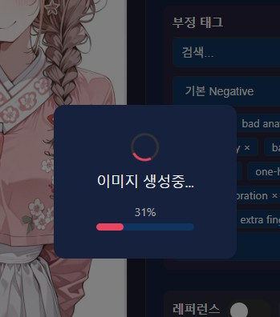
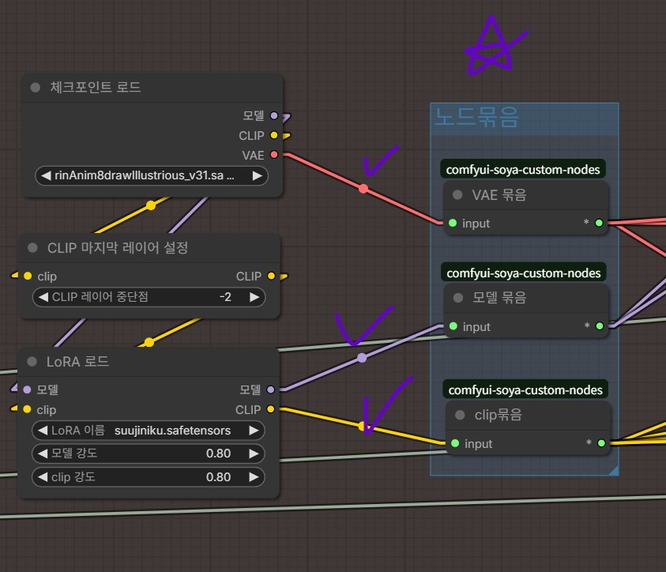

안녕!

프로그램 잘 사용하고 있을까?

자주 공지를 올려서 미안해 

아직 초기 버전이라 개선할 부분이 있고

내가 최대한 빠르게 일을 끝내고 싶어서 그래
(가능하면 이번 주말에)

안정화 되면 이렇게 매일 공지를 올려대지는 않을테니까

당분간은 좀만 참아줘

이번이 중요 공지인 이유는 브렌치 관련하여 바뀐 내용이 있어서 그래

설정을 안해두면 추후 업데이트 등에 불편함 등을 겪을 수도 있으니 미리 설정해줘

이번 공지는 중요도 순으로

1. 브렌치 관련 안내
2. 매니저 프로그램 버그 수정 안내
3. comfy 워크플로우 YoloFACEID 로직 수정
4. comfy 워크플로우 개선 안내(사소한 편의성 개선)
5. 기타 사항
6. 개발 방향

순으로 안내를 진행할께(5번, 6번은 안 읽어도 되), 

브렌치 공지 제외 관심 없다면 넘기면 되고, 더 자세히 알고 싶다면 챈 원문을 참고해줘

---

1. 브렌치 관련 안내 (중요)

Comfy 측에 설치하는 soya-custom-nodes 관련하여

원문에서 v3.1 (Ray를 제거한 미니멈 버전)과 v4 (현재 개발중에 있는 모든 노드를 포함한 버전)

이렇게 두 브렌치를 안내하고 있었고, 많은 챈럼들이 v4로 설치했을텐데

이번에 v4 브렌치를 삭제하고, main 브렌치로 병합했어

v4랑 main이랑은 사실상 동일한 내용을 담고 있어서 그래

패키지를 깔끔하게 쓰고 싶다면, 이번에 v3.1 브렌치로

현재와 동일한 상태를 유지하고 싶다면, main 브렌치를 가르키도록 조치를 취해주는 걸 부탁할께

브렌치 설정법이 궁금하다면, 챈 원 글에서 문제 발생시 섹션에서 프로그램을 업데이트 하는 방법 섹션을 참고해줘

---

2. 매니저 프로그램 버그 수정 안내

아래와 같이 대표 이미지를 모아보는 창에서 프롬프트를 편집하면 스크롤이 최하단으로 강제로 내려가는 버그가 있었을꺼야 해당 버그는 수정되었어

또한 이미지 개별 생성시 진행도가 제대로 표시되지 않는 버그가 있었을꺼야 해당 버그도 수정되었어

이번 버그 수정 사항이 마음에 든다면

git pull 명령어를 통해 매니저 프로그램을 업데이트 해줘

---
3. Soya FaceID YOLO Fallback (Soya) 로직 개선

아래 두 사항을 개선하였어

1. 현재 레퍼런스 이미지 여부 및 update_model 로직 관계없이 face detection을 시도하고 있다는 제보를 받아서 로직을 수정했어. face id detection은 무거운 작업이 아니지만 이미지가 로드 안된 상태에서 시도하려고 하면 오류가 날 수 있어

2. 일부 포터블 환경사용자는 환경변수 등록 이슈로, 깃 클론으로 깐 노드를 인식 못할 수도 있어, 디렉토리를 강제로 추가하는 코드를 넣었으니 일부 사용자의 문제가 해결될 것으로 기대되네

만약 해당 노드 관련하여 문제를 겪고 있었다면
git pull 명령어를 통해 comfy측 soya-custom-nodes를 업데이트 한뒤 시도해봐

그 외 원글에 문제 발생시 섹션에 해당 노드에 대한 가이드들을 추가해두었으니 확인하고 진행해보는 걸 추천할께

---

4. comfy 워크플로우 개선 안내(사소한 편의성 개선)

생각보다 많은 챈럼들이 자신만의 모델과 로라로 교체를 시도하는 걸로 인지하고 있어

하지만 내가 초기에 공유한 워크플로우는 모델 노드와 로라 노드에 샘플러들이 직접적으로 연결되어 있어서 건들기가 꺼려지는 상태였을꺼야

원격 변수 설정 방식과 노드 모아보기 방식 중 고민하다가 

연결 구성방식이 어떻게 되어있는지 궁금한 사람들도 있을 것 같아서 아래와 같이 노드를 중간에 묶어주는 노드를 추가하는 방식으로 문제를 개선했어

체크포인트 로더를 바꾼다던가, 로라를 추가하는데 이제 부담이 많이 줄었을꺼야

바뀐 워크플로우는 원문 프로톤 링크에 올라가있고

추가된 노드의 정상적 이용을 위해서는 comfy측 soya-custom-nodes 업데이트가 필요해

이번에 수정된 워크플로우가 마음에 든다면

git pull 명령어를 통해 커스텀 노드를 업데이트 한 뒤 새로운 워크플로우를 다운받아 이용해줘

---

5. 기타사항

본문에 Soya FaceID YOLO Fallback(Soya) 관련 문제발생시 시도 사항 추가
섹션-문제발생시

|-- Soya FaceID YOLO Fallback (Soya)에서 에러가 나요-우선 시도해보기

|-- Soya FaceID YOLO Fallback (Soya)에서 여전히 에러가 나요-대체 워크플로우 사용하기

프로그램 개선

에셋/삽화 매니저-v3 프로그램의 알림 기능 개선(못읽은 알림이 있다면 메인에서 알아차릴 수 있게)

Lv1 튕김 현상 개선

로딩바 오류 개선

워크플로우 개선- 라인을 묶는 기능을 만들어 모델 교체 및 로라 교체 작업이 용이하도록 개선 

추가된 노드는 v3.1 및 v4 브렌치에 업데이트 완료

Soya FaceID YOLO Fallback (Soya)를 사용하지 않는 호환 워크플로우 저장소에 추가 관련 내용은

아래 섹션 참고 

섹션-문제발생시

|-- Soya FaceID YOLO Fallback (Soya)에서 여전히 에러가 나요-대체 워크플로우 사용하기 

본문에 원격 네트워크 접속 거부시 조치법 추가

커스텀 노드 깃 브렌치 v3.1, v4, main 업데이트 완료, 

에셋/삽화 매니저 v3, main 브렌치 업데이트 완료

브렌치 정리 작업

본문 설명에서

soya-custom-nodes v3.1로 고정

soya-custom-nodes v4 삭제(혼동만 유발하며 설치 실패 사례가 나오고 있음), 실제 브렌치도 삭제 예정

comfyui_hooking_server는 main으로 고정(개발용과 배포용 구분 불필요)

프로그램 공지에 브렌치 삭제 알림 및 브렌치 변경 가이드 포함

안정성 테스트

|-워크플로우 실행 확인(삽화 워크플로우 & 에셋 메이커 워크플로우)

|- 단일 실행 확인

|- 연속 실행 확인

|- Lv1 스크롤 다운 버그 픽스 확인

|- 알림 테스트 확인

---
6. 개발 방향

워크플로우 개발과 기능 추가보단 프로그램 안정화에 집중

설치를 어려워하는 사람들을 위해 도커로 이사예정

(이미 설치한 사람은 그대로 이용해도 무방)

개발 방향이 마음에 안든다면 조언해줘도 되, 원글에 댓글을 남겨줘

(반영은 안될수도 있어)

---

버그 제보/피드백은 항상 받고 있어 댓글에 남겨줘

복잡한 사항은 글을 쓴 뒤 글의 링크를 댓글에 남겨줘

문제를 해결한 케이스를 올려주면 정말 도움이 많이 되

있을지는 모르겠지만, 원한다면 프로그램 개조/편집 가능 (만들면 댓글에 남겨줘)

출처없는 프로그램 무단 도용이나, 상업적 이용은 삼가해줘