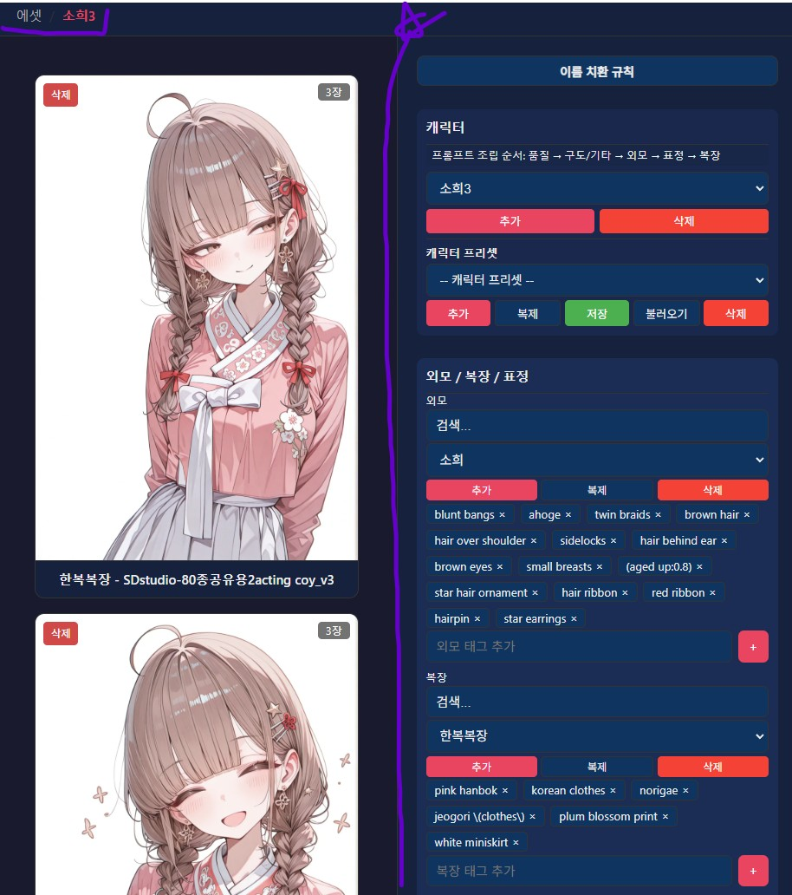
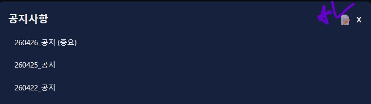

안녕?

오늘 공지는 길지 않아

다음 순서로 진행할께

1. 본문 가이드 추가 내역

2. 버그 수정 및 프로그램 개선

3. 진행 방향

---

1. 본문 가이드 추가

원글에 해당 프로그램에 대한 다음 4가지의 가이드를 추가했어

1. 에셋/태그/포즈/프리셋 이사하기(데이터 구조 파악하기)

2. 커스텀 체인 프리셋 만들기

3. 체인 프리셋 공유 및 로드

4. 커스텀 모델 사용 가이드

시간되면 나중에 구경해봐

혹시 모르지 좋은 팁을 발견할지도?

---

2. 버그 수정 및 프로그램 개선

아래와 같이 대표 이미지를 모아보는 창에서 프롬프트를 편집하면 스크롤이 최하단으로 강제로 내려가는 버그가 있었을꺼야 해당 버그는 수정되었어, 어제 수정한 줄 알았는데 Lv2 탭으로 이동 후 Lv1으로 돌아오면 버그가 재현되더라고, 어쨋든 이젠 고쳐졌을꺼야

원글에 바로 접속할 수 있는 버튼을 추가했어

누르면 이 챈에 있는 프로그램 소개글이 열려

이번 프로그램 개선 사항이 마음에 든다면

git pull 명령어를 통해 매니저 프로그램을 업데이트 해줘

---
3. 진행 방향

설치 관련 지원은 잠시 중단했어

당분간은 배포를 위해 도커 기반 패킹 작업에 집중할 생각이야

배포 전까지 따로 공지나 개선 사항은 아마.. 없을껄?

다만 버그 같은건 항상 제보 받고 있으니까

발견하면 말해줘

---

버그 제보/피드백은 항상 받고 있어 댓글에 남겨줘

복잡한 사항은 글을 쓴 뒤 글의 링크를 댓글에 남겨줘

문제를 해결한 케이스를 올려주면 정말 도움이 많이 되

있을지는 모르겠지만, 원한다면 프로그램 개조/편집 가능 (만들면 댓글에 남겨줘)

출처없는 프로그램 무단 도용이나, 상업적 이용은 삼가해줘