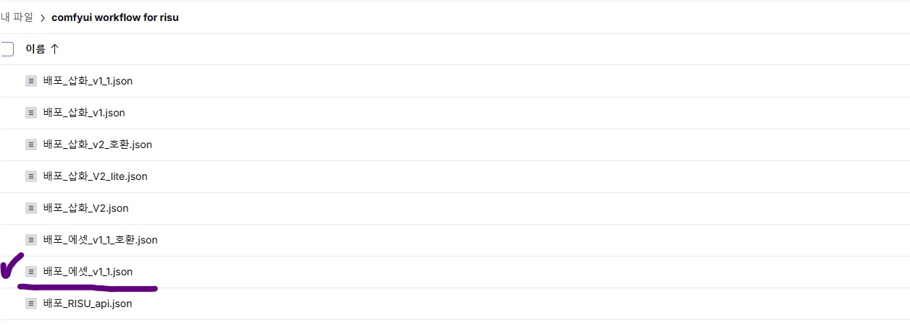
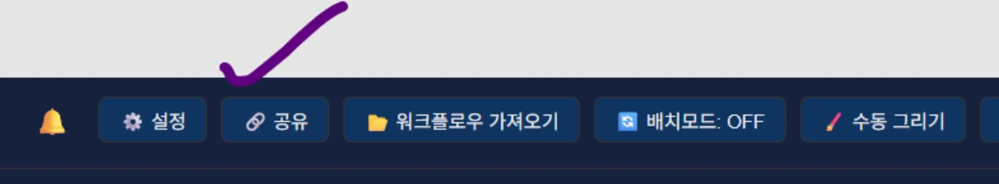
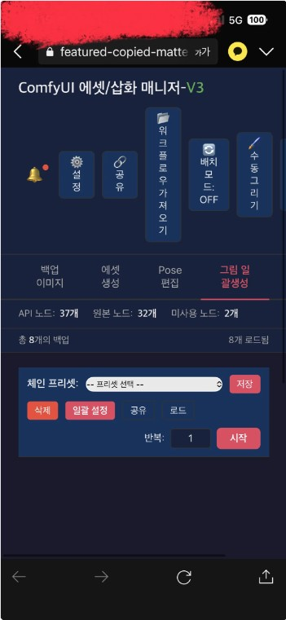

안녕?

업데이트 관련 소식이 있어서 공지를 올려

이번 공지는 기존 사용자, 즉 Comfypack 출시 이전 네이티브 설치 사용자에게 중요한 순서대로

1. 업데이트 시 주의점 안내

2. 업데이트 내역

3. 공유 파일 위치 변경 안내

4. 삽화 관련 가이드 안내

5. Comfypack 출시 안내

순서대로 진행할께

도커 기반 Comfypack 사용자는 이번 공지 무시해도 괜찮아

기존 사용자를 위한 공지야

---
업데이트 시 주의점 안내

4월 30일 경에 브렌치 병합 작업을 진행하며 잠시 업데이트를 멈춰달라고 부탁했었는데

테스트까지 마쳤으니 이제 업데이트 해도 괜찮아

다만 문제가 되었던 impactpack 의존성을 제거하기 위해 에셋 워크플로우쪽 몇개 노드가 내용이 바뀐 상태야

업데이트 시 기존에 사용했던 에셋 워크플로우는 삭제 처리하고 새로운 워크플로우를 다운받아서 사용해줘

아래 링크로 들어가서

https://drive.proton.me/urls/RS0Y2NTZZ8#G8r7ZkL69xz9

아래 그림과 같이 배포_에셋_v1_1.json을 가져다가 사용하면 되

업데이트 방법은 아카라이브쪽 본문(ComfyUI 에셋/삽화 매니저-v3) 글을 참고해서 진행하면 되

문제 발생시 섹션에서 프로그램을 업데이트 하는 방법에 있어

대충 방법은 알지만 명령어가 애매하게 기억나는 사용자를 위해 명령어만 적어둘께

1. git branch --show-current

2. (옵션) git checkout v3.1

3. git pull

ComfyUI 내부 soya-custom-nodes와 프로그램 본체 양쪽에 대해 모두 진행 부탁할께

조만간 업데이트 딸깍 버튼도 만들어볼테니

당분간 불편해도 직접 폴더로 들어가 진행해줘

---
업데이트 내역

Soya custom nodes 쪽

Soya custom nodes 쪽에서 일부 노드의 impact pack 의존성을 제거했어

사용자가 느끼기엔 다른 건 없겠지만

업데이트를 했다면 반드시 에셋 워크플로우를 반드시 새로운 워크플로우로 교체해서 사용해줘

에셋/삽화 매니저 쪽

임시 Https 링크를 발행하는 버튼을 추가했어

에셋/삽화 매니저 업데이트 시 아래와 같은 버튼이 보일꺼야

버튼을 누르면, 임시 Https 주소가 발행되고, 복사해서 사용할 수 있어

외부에서 핸드폰 등을 통해 생성 진행 정도를 알고자 할때 유용하게 쓸 수 있을껄로 기대되네

---

공유 파일 위치 변경 안내

공유하는 워크플로우의 양이 많아져서 폴더 정리를 진행했어
다시 다운 받아야 할 일이 있다면 참고해줘

에셋, 프리셋 등의 프로그램 패치에 필요한 자료는 다음 주소: 
https://drive.proton.me/urls/920TAA4XK4#pYNVlbq02fWe

워크플로우 관련 자료는 다음 주소: 
https://drive.proton.me/urls/RS0Y2NTZZ8#G8r7ZkL69xz9

---

삽화 관련 가이드 안내

Comfypack 소개글에 삽화 관련 가이드를 추가했어

혹시 이 프로그램을 통해 삽화 기능도 쓰고 싶었던 사용자는 아래 Comfypack 소개글을 참고해줘

https://arca.live/b/characterai/169454867

---

Comfypack 출시 안내

도커로 환경을 패킹한 Comfypack을 출시했어

이미 네이티브 설치에 성공한 사람들은 볼 이유가 없는 글이지만

시간 남으면 한번 구경해보는 것도.. 괜찮을지도?

https://arca.live/b/characterai/169454867

---

버그 제보/피드백은 항상 받고 있어 댓글에 남겨줘

복잡한 사항은 글을 쓴 뒤 글의 링크를 댓글에 남겨줘

문제를 해결한 케이스를 올려주면 정말 도움이 많이 되

있을지는 모르겠지만, 원한다면 프로그램 개조/편집 가능 (만들면 댓글에 남겨줘)

출처없는 프로그램 무단 도용이나, 상업적 이용은 삼가해줘