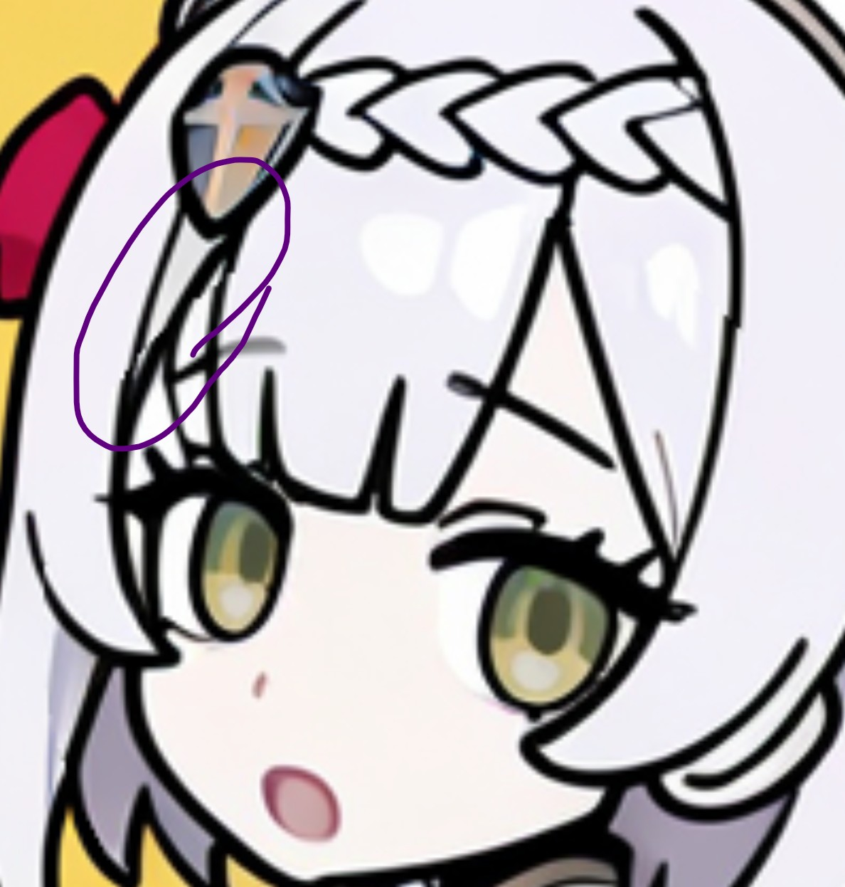
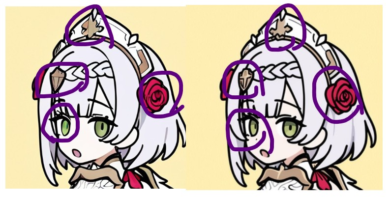
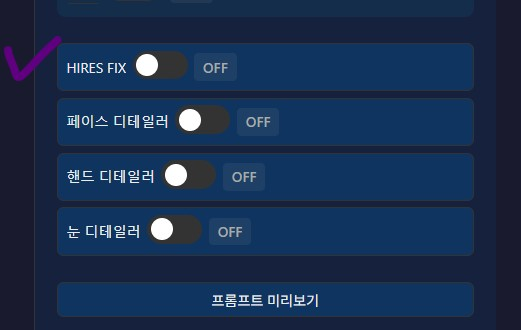
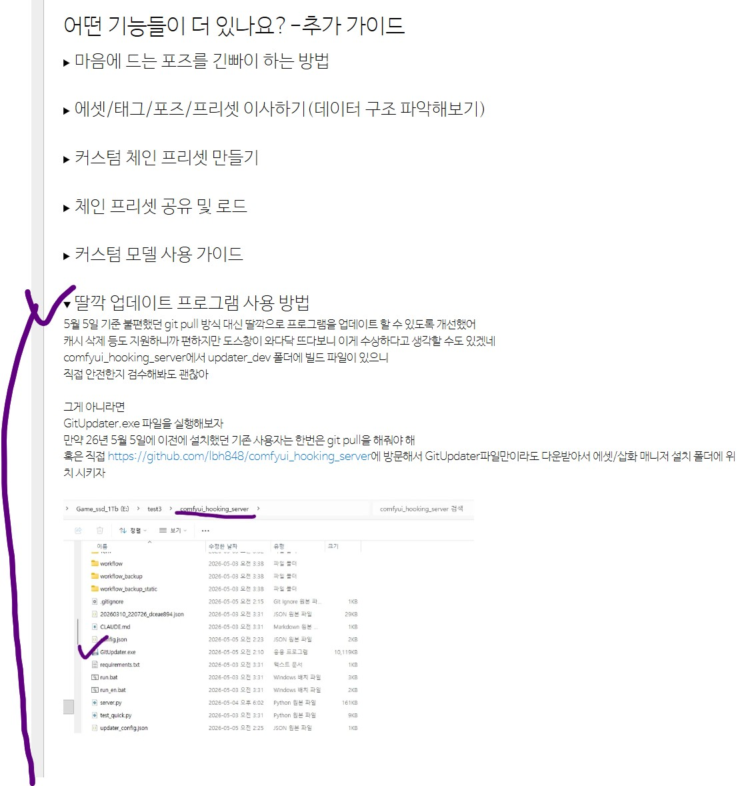
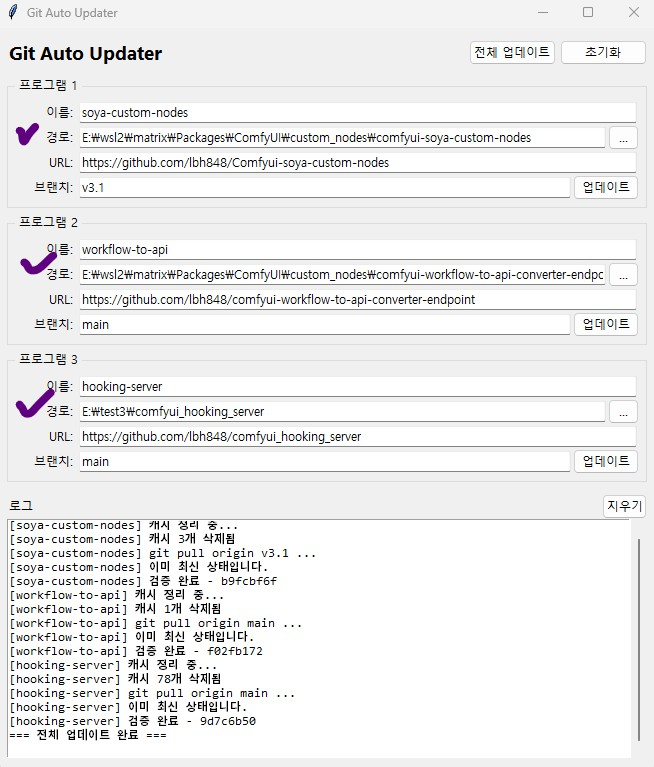
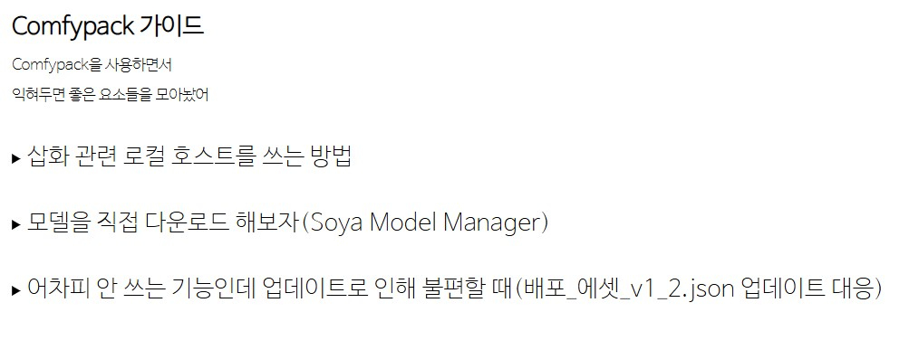
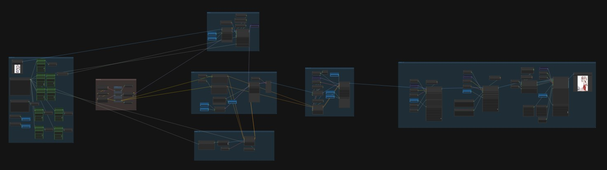

안녕?

오늘 전할 소식은 8가지나 되

덕분에 조금 공지가 길어질 것 같네

이번 공지는 네이티브 에셋 기능 사용자와 comfypack 에셋 기능 사용자

모두가 대상이야

삽화이용자는 이번 업데이트와 관련이 없지만

네이티브 사용자의 경우 업데이트 개선에 대한 소식을

Comfypack 사용자의 경우 모델 다운로드 방법에 대한 

소식을 얻을 수 있으니 삽화 이용자라도 훓어보는걸 추천할께

중요도에 따라 다음 순서대로 진행할께

1. 버그 수정 안내

2. 업데이트 안내

3. HIRESFIX 기능 출시

4. 5월 4일 새벽 2시부터 5월 4일 오후 5시 사이에 설치한 사람이 주의할 점 

5. (네이티브 사용자용) 딸깍 업데이트 프로그램 안내

6. (Comfypack 사용자용) 모델 다운 가이드 안내

7. 워크플로우 개선 및 본문 최신화 안내

8. 개발 진행 방향 안내

1번부터 3번은 꼭 읽어주고,

4번부터 6번은 해당 사용자만 읽어주면 되

7번 8번은 안 읽어도 괜찮아

궁금하면 읽어봐

---
1. 버그 수정 안내

삽화 디테일러 중 ED 즉 Eye Detailer에서 paste-back을 할 때 일부 케이스에서 1~7 Pixel 정도 다르게 Resize되는 버그를 발견했어

이 버그를 그대로 둘 경우 아래와 같이 

눈 주변에 경계가 보이는 불편함을 겪을 수 있어

지금은 해당 버그를 수정한 상태야

업데이트 작업이 귀찮은 작업이니 왠만하면 자율적으로 업데이트를 하도록 안내하고 있으나

이번 버그는 에셋 품질과 관련된 부분이라

반드시 업데이트 해서 사용하는 것을 권장할께 

---
2. 업데이트 안내

이번에 워크플로우에 에셋 생성에 HIRES FIX 기능을 포함함에 따라

업데이트 시 워크플로우를 다시 다운 받아야 해

배포_에셋_v1_2라는 이름으로 아래 프로톤 링크에 올려놨어

https://drive.proton.me/urls/920TAA4XK4#pYNVlbq02fWe

또한 HIRESFIX 과정에서 모델이 멋대로 눈의 크기를 바꾸거나.. 하는 일을 막기 위해 컨트롤넷을 추가했어

때문에 아래 링크에서 Canny 계열 컨트롤넷을 추가로 다운받아야해

https://civitai.com/models/929685/noobai-xl-controlnet

편하게 사용하고 싶을텐데 잦은 업데이트로 인해 불편함을 겪게 해서 미안해

이번 업데이트에서 한번에 해결하기 위해 넣고 싶었던 기능을 넣고 

워크플로우 정리도 진행했으니까

이번 한번만 양해를 구할께 

---

3. HIRES FIX 기능 출시 안내

이미지 해상도를 2배로 키운 다음

약하게 디노이즈를 해서 다시 그리는 기능이야

이미지 품질을 위해 많이 사용하는 기술이기도 하고 

일부 에셋(ex.전신 에셋) 등에서는 큰 효과를 얻을 수 있기 때문에 포함시켰어

해당 기술 사용을 위해서는 워크플로우, comfy custom nodes 업데이트, 프로그램 본체 업데이트 총 3군데의 필요하지만

이번에 딸깍 업데이트 프로그램을 포함해서 업데이트시 겪는 불편함을 최소한으로 했으니 편하게 이용해줘

더 자세한 설명은 아카라이브 본문(ComfyUI 에셋/삽화 매니저-v3)에서 프로그램 구성 소개 섹션 -> 10-워크플로우 설명 -> E.HIRESFIX 구간 설명을 참고해줘

업데이트가 끝난 프로그램에서 다음과 같이 ON/OFF를 통해 편하게 토글해서 사용하면 되

---

4. 5월 4일 새벽 2시부터 5월 4일 오후 5시 사이에 설치한 사람이 주의할 점 

혹시 이때 설치한 사람은 아래 그림과 같은 현상을 겪을 수 있어

내가 이미지 미리보기를 삭제 안한 채 워크플로우를 올린 탓이야

정상적인 상황이 아니니

이번에 업데이트해서 해결해줘

---

5. (네이티브 사용자용) 딸깍 업데이트 프로그램 안내

아카라이브에 있는 ComfyUI 에셋/삽화 매니저-v3

소개글에서 어떤 기능들이 더 있나요?-추가 가이드에

딸깍 프로그램에 대한 소개와 설명을 적어놨어

폴더 위치 설정이 필요하지만

한번만 설정해두면 끝이니

업데이트로 인한 번거로움을 조금 줄일 수 있을꺼야

해당 프로그램의 UI는 다음과 같이 생겼고 

경로만 입력해주면 되

---

6. (Comfypack 사용자용) 가이드 안내

Comfypack 사용자는 Windows_02_installer를 이용해 편하게 업데이트를 진행하면 되지만

워크플로우를 직접 다운받아줘야하는 점은 동일해

또한 이번 업데이트를 기회 삼아 모델을 직접 다운받는 가이드를 추가했어

이번 업데이트에 관심 없는 사용자를 위해

업데이트를 진행한 후 최소한의 노력으로 프로그램을 이용하는 가이드도 적어놨어 

(단 HIRESFIX 기능 사용 불가)

---

6. (Comfypack 사용자용) 가이드 안내

Comfypack 사용자는 Windows_02_installer를 이용해 편하게 업데이트를 진행하면 되지만

워크플로우를 직접 다운받아줘야하는 점은 동일해

또한 이번 업데이트를 기회 삼아 모델 다운 방법을 익힐 수 있도록

관련 가이드를 추가했어

이번 업데이트에 관심 없는 사용자를 위해서도

업데이트를 진행한 후 최소한의 노력으로 프로그램을 이용하는 가이드도 적어놨어 

(단 에셋 생성시 HIRESFIX 기능 사용 불가)

---

7. 워크플로우 개선 및 본문 최신화 안내

워크플로우 연결을 원하면 공부할 수 있게끔

일부러 연결선을 남기고 있었으나

지나치게 난잡하다는 생각이 들어서

결국 정리를 진행했어

일부 사용자를 제외하고는 좋은 소식이 될 것 같네

또한 이번 업데이트에 맞추서 본문 사진이나

일부 문구 등을 수정했어

내용적으로 다른 부분은 거의 없으니 굳이 가서 구경 안해도 될꺼야

---

8. 개발 진행 방향 안내

원래 이 프로그램을 출시하고, 이 프로그램에 사용할 수 있는 프리셋 등을 개발하고 공유해볼 생각이였으나..

설치 이슈라던가.. 도커 패킹 작업 등으로 인해 이게 좀 미루어진 상태야

이제 좀 가지고 놀다가 괜찮은 에셋 프리셋을 만들게 되면 공유하거나

혹은 가이드를 쓰면서 나도 실력을 키워볼 것 같네

아 삽화 워크플로우 v3도 마무리 하고

혹시 이 세 개 중 원하는게 있으면 댓글 남겨줘

그게 나한테도 동기가 되거든

따로 요청이 없으면 당분간은 마음가는대로 해볼께

다른 연휴 잘 마무리하고..

다음에 또 보자

버그는 꼭 제보해주고

---

버그 제보/피드백은 항상 받고 있어 댓글에 남겨줘

복잡한 사항은 글을 쓴 뒤 글의 링크를 댓글에 남겨줘

문제를 해결한 케이스를 올려주면 정말 도움이 많이 되

있을지는 모르겠지만, 원한다면 프로그램 개조/편집 가능 (만들면 댓글에 남겨줘)

출처없는 프로그램 무단 도용이나, 상업적 이용은 삼가해줘