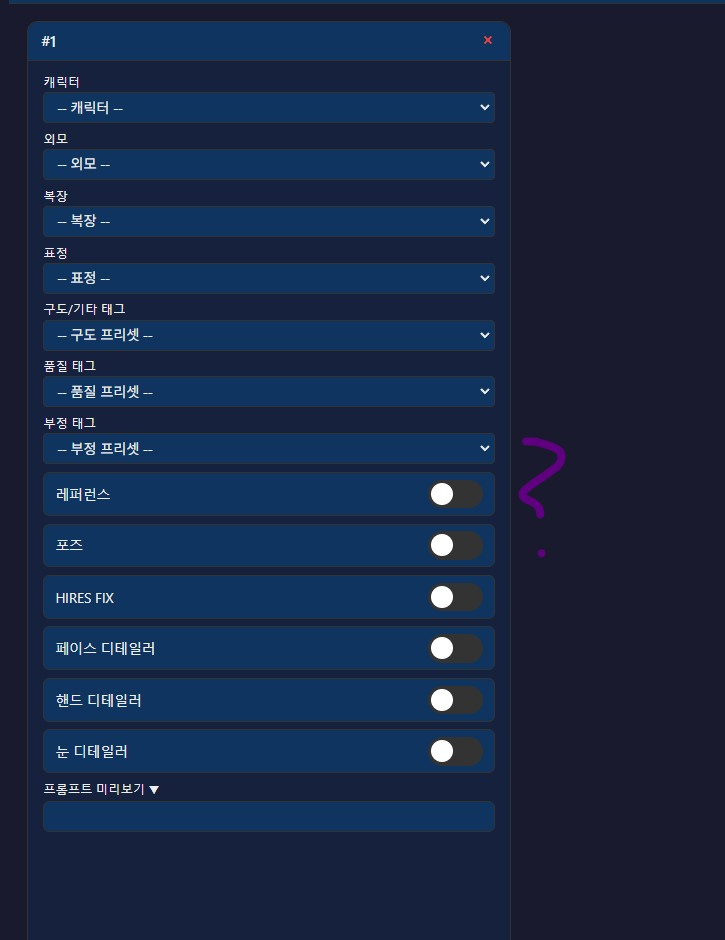
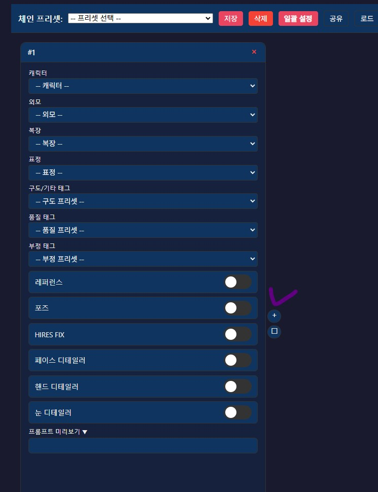

이번에는 크게 불편할 수도 있는 부분이 있어서,

이번에는 긴급 버그 수정해서 공지 올렸어

---

그림 일괄 생성에서 커스텀 체인을 생성하고자 할 때

아래 그림 처럼 버튼이 날아간 상태였을텐데

이건 좀 큰 사항 같아서 

긴급하게 아래와 같이 수정해서 다시 깃 서버에 올려둔 상태야

불편함을 겪게 해서 미안해

업데이트 방법은 이전 공지에 잘 나와있고

그냥 comfypack이든, 네이티브든

그냥 딸깍만 하기만 하면 될꺼야

---

현재 인지한 버그는

1. 이미지 업로드 기능은 영구적이지 않고 휘발적인 점

2. 프리셋 일괄 삭제 기능이 없어 불편한 점

3. HiRESFIX와 FD/HD/ED의 호환성이 나쁜 점

이 세 개이고

이 외 이번에 청원부고용 페르소나 만드는 가이드를 만들어보면서 추가적인 버그들, 혹은 수정 사항을 발견하면

주말.. 쯤에 한번에 수정해서 프로그램을 개선해볼께

다시 한번 불편함을 겪게해서 미안해

조금이라도 프로그램이 이상하다 싶으면

언제든 바로 제보해줘

---

버그 제보/피드백은 항상 받고 있어 댓글에 남겨줘

복잡한 사항은 글을 쓴 뒤 글의 링크를 댓글에 남겨줘

문제를 해결한 케이스를 올려주면 정말 도움이 많이 되

있을지는 모르겠지만, 원한다면 프로그램 개조/편집 가능 (만들면 댓글에 남겨줘)

출처없는 프로그램 무단 도용이나, 상업적 이용은 삼가해줘