안녕?

이번 공지에서는 대량의 프로그램 편의성 개선 업데이트를 준비했어

공지를 진행하기 앞서..

저번에 추가한 HiRESFIX 기능에 대해

내 설명이 좀 부족했던거 같아

문의가 종종 들어오더라고

그래서 다음 순서로 진행할께

1. HIRESFIX 기능에 대해서

2. 워크플로우 버전업 안내

3. 편의성 수정 내역들

---
1. HIRESFIX 기능에 대해서

내가 추가한 HIRESFIX 기능은
2배로 이미지 사이즈를 증가시킨 다음에
그림을 다시 그리는 기능이라
많은 Vram이 요구될꺼야

추후에 tile별로 Hiresfix를 하는 기능을 추가할 계획이지만
지금 이 시점에서는 vram 16정도가 안정적인 사용 범위 같네

그냥 토글을 끄고 사용하면 평범하게 쓸 수 있겠지만, 아예 그쪽 노드에서 멈추는 현상이 발생하는 사람이 있다면

워크플로우에서 해당 부분을 아래 그림과 같이 비활성화하고 쓰는 걸 추천할께

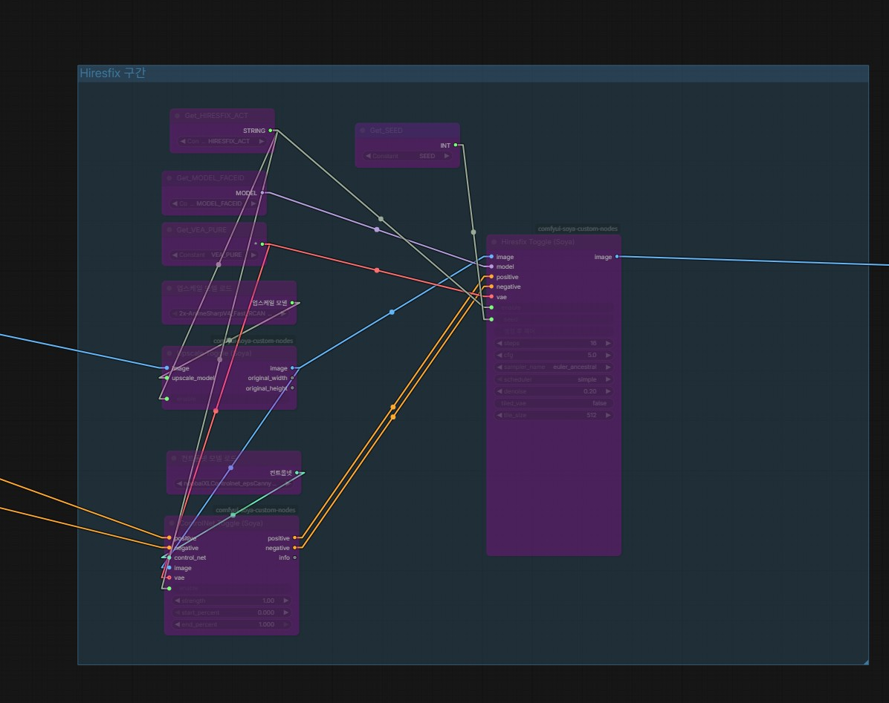

워크플로우를 수정한 뒤에는 꼭 CTRL+S를 눌어 저장하고 사용해주자

참고로 CTRL키를 누르고 드래그해서 여러 노드를 잡을 수 있고

CTRL+B를 눌어 일괄 비활성화하거나 활성화할 수 있어

그리고 워크플로우에서 HIRESFIX노드 보면 tiled_vae라는 기능이 있어

디코딩 인코딩 단계에서 tile로 진행하는 기능이고

될듯 말듯 아슬아슬하다면 true로 바꿔서 사용해하면 될꺼야

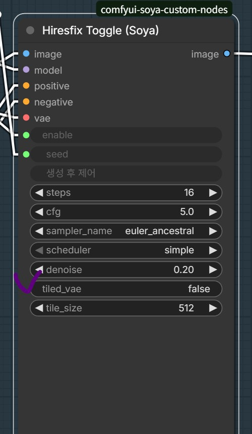

마지막으로 해당 기능의 사용을 위해서는

내 의도상으로는 컨트롤넷 모델이 필요해

comfy에 익숙하지 않은 사용자는
Comfypack글에 잘 설명되어 있으니 참고해줘

다만 컨트롤넷도 vram 2GB나 먹는 무거운 기능이야

해당 기능 없이 HIRESFIX를 쓰는 것도 나쁘지는 않으니 원하는 사람은 다음과 같이 ControlNet 부분만 비활성화해서 사용해보자

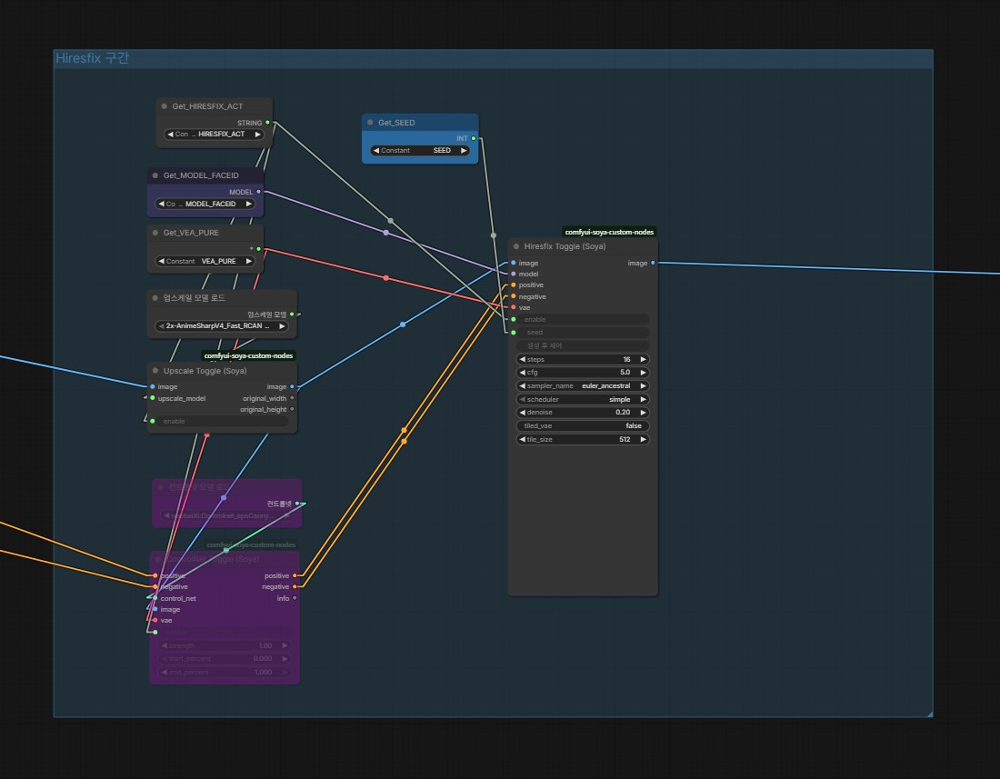

---

2. 워크플로우 버전업 안내

이번에 배포_에셋_v1_3.json

로 워크플로우를 바꿔서 올렸어

나도 워크플로우 바꾸는거 귀찮은 일인거 알고 있어서 가능하면 백앤드만 바꾸고 싶으나..

HIRESFIX 기능과 나머지 ED/FD/HD 호환성을 위해서는 워크플로우의 구조적 변경이 불가피한 상황이야

워크플로우를 안바꾸고 업데이트만 하면 예기치 못한 문제가 발생할 수 있으니까
꼭 변경해줘

그 외 설치를 시작하는 사람들이 많이 헤매는 로드레퍼런스쪽 이미지 문제를 해결하기 위해 그냥 폴백 기능이 있는 내 커스텀 노드로 바꾸었고

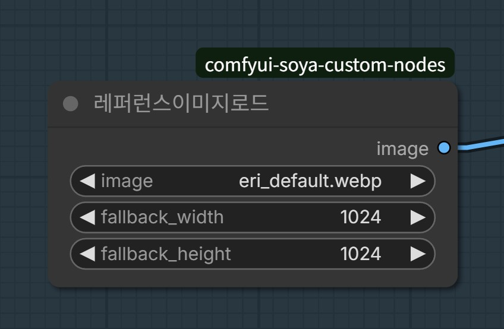

튜토리얼 모델에 맞춰서 1차 k-sampler를 제외한 나머지 디테일러들의 step과 cfg 최적화를 진행했어

내 설정값 그대로 쓰던 사람들에게는 좋은 소식이 될 것 같네

모든 옵션을 켰을 때 아래와 같은 그림이 나와

이전에는 종 같은게 뭉개졌는데 이제는 깔끔하게 나오네

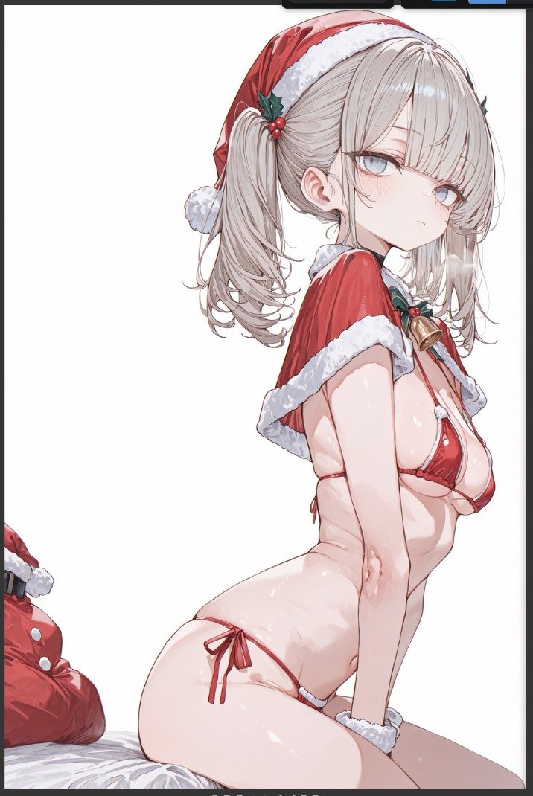

바뀐 흐름에 대해 말하자면..
이전에는 Hiresfix를 한 다음 원본 크기로 되돌려서 나머지 흐름을 진행했는데

이제는 Hiresfix로 업스케일링된 상태에서 나머지 흐름을 진행하고 마지막에 축소시키는 방향으로 갔어

덕분에 이제 모든 옵션을 키면, 그냥 킨 만큼 더 잘 나와줄꺼야

---

3. 편의성 수정 내역들

===

이름 치환 규칙 설정 추가

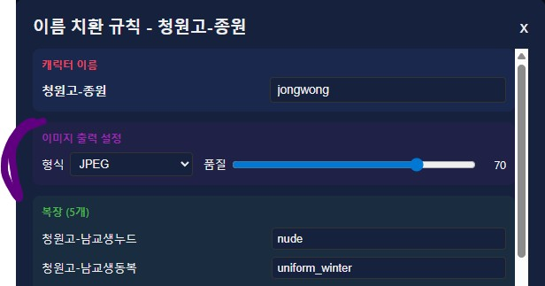

이번에 이름 치환 규칙에 포맷 형식과 품질을 결정할 수 있는 옵션을 추가했어

애초에 서버에 webp 90 품질로 저장되기 때문에 90이 최대고

저기서 품질을 결정하면 알아서 내부적으로 목표 품질을 계산한 다음 재 압축해서 배출해줘

jpeg, avif 같은 포맷 옵션들이 있으니 원하는거 사용해줘

avif 같은 경우 시간이 조금 오래 걸려

cmd를 보면 진행상황이 보이니까 
보면서 기다리면 될꺼야

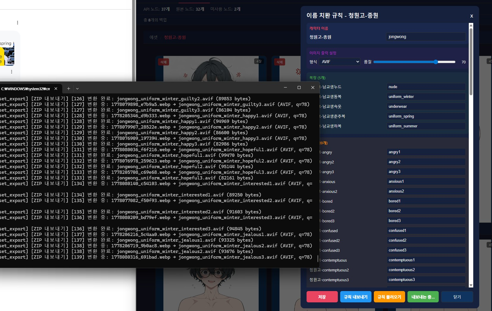

===

포즈 모드 편집 내역이 에셋에서 바로 보이지 않던 문제

포즈 모드에서 포즈를 편집한 뒤, 에셋 탭으로 넘어가면 새로 고침을 해야 추가했던 내역이 보였을꺼야

해당 버그는 수정되었어

===

포즈 편집 내역이 위 아래가 잘려서 보였던 문제

포즈 편집 선택에서 아래와 같이 보이던 걸
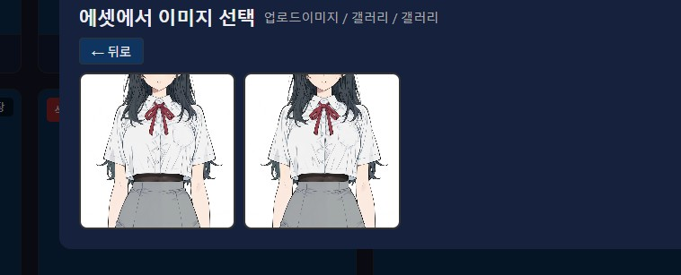

아래와 같이 보이게 고쳤어, 길쭉한 이미지를 쓰던 사람들에게는 좋은 소식이겠네
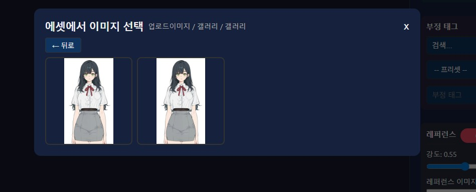

===

일괄설정에서는 표정과 구도/기타 태그를 변경할 수 없었던 문제

사용의 자유도를 높이기 위해 표정과 구도/기타 태그를 일괄로 변경할 수 있게 추가했어

이제는 여러 캐릭터의 같은 감정 일괄뽑기 같은 것도 원한다면 진행할 수 있겠네

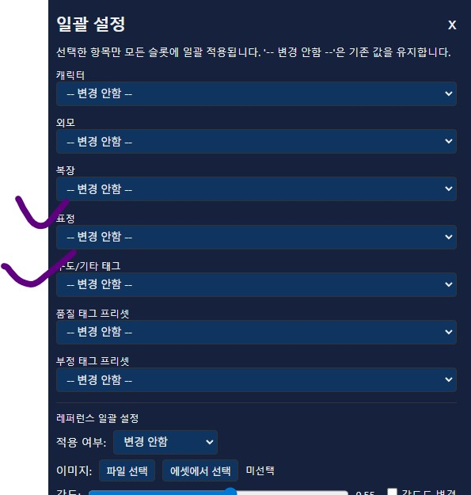

===

이미지 업로드 기능 휘발성 수정

레퍼런스 기능에서 이미지 업로드 기능을 쓰던 사람들은 탭을 이동하거나 프로그램을 껐다 키면 레퍼로 올려놨던 이미지가 날아가서 힘들었을꺼야

이미지 업로드를 통해 올리면, 해당 이미지는 에셋/업로드이미지/갤러리-갤러리에 저장되니, 원하면 언제든 꺼내쓰면 되고

내부적으로도 에셋 로드와 동일한 방식으로 이미지를 호출하니 이미지가 증발하거나 하는 일은 이제 없을꺼야
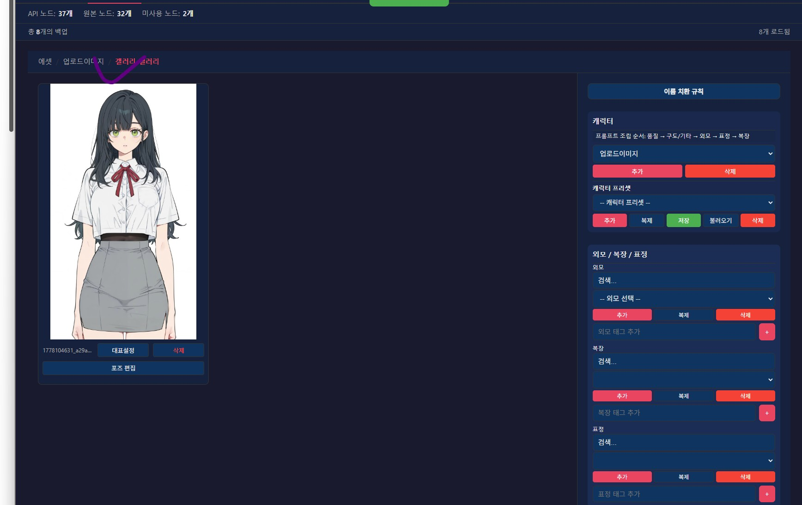

===

워크플로우 폴백 로드 기능 추가

만약 모종의 이유로, 없는 워크플로우를 불러올려고 프로그램이 시도하는 경우

아래 모드 워크플로우 폴더에서 워크플로우를 불러오는 시도를 진행해

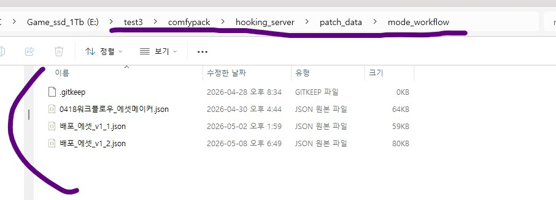

만약 워크플로우가 로드가 안된다면,

저 폴백 기능을 이용하자, 워크플로우 json 파일을 저 폴더에 넣어두면 작동해

다만 불편할테니까
임시로 문제를 해결해도
같은 증상을 겪고 있다면 꼭 댓글로 남겨줘

---

업데이트 시 테스트를 진행하기는 하지만,

항상 예상치 못한 문제들이 나오니 오늘은 늦게까지 예의주시 해볼께

업데이트 중 문제 생기면 바로 댓글 남겨줘

공지에서 질문있으면 댓글 남겨도 되

---

버그 제보/피드백은 항상 받고 있어 댓글에 남겨줘

복잡한 사항은 글을 쓴 뒤 글의 링크를 댓글에 남겨줘

문제를 해결한 케이스를 올려주면 정말 도움이 많이 되

있을지는 모르겠지만, 원한다면 프로그램 개조/편집 가능 (만들면 댓글에 남겨줘)

출처없는 프로그램 무단 도용이나, 상업적 이용은 삼가해줘