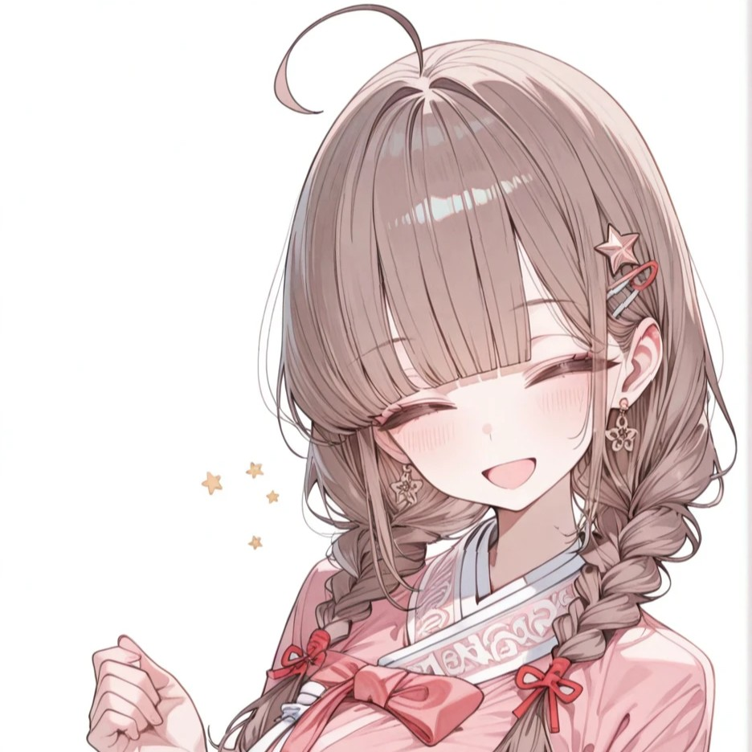
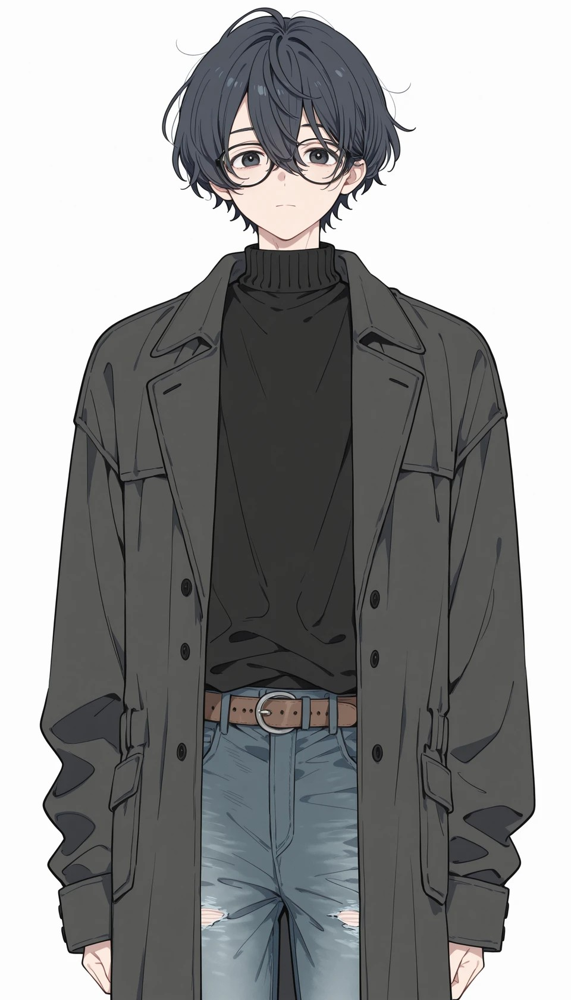

안녕?

오늘은 좋은 소식을 알려주기 위해 글을 썼어

귀찮게 또 업데이트야? 하는 걱정은 ㄴㄴ

청원부고라고 알까?

챈의 전설 같은 시뮬봇인데

에셋 로컬로 만들었다는거 모르는 사람 은근히 많더라고

이번에 가이드를 쓰면서 제작자님께서 공유해주신 워크플로우를 분석하고

청원부고 스타일의 남자 캐릭터를 만든 후

청원부고 봇에 넣는 과정까지 담은 E2E 스타일의 가이드를 만들었어

아래와 같은 사람들에게 도움이 될 것 같네

1. 남캐 만드는 과정이 궁금했던 사람

2. 튜토리얼 모델과 로라를 벗어나 좋은 품질의 에셋을 만들고자 했던 사람

3. 만든 에셋을 어떻게 활용하면 좋을지 궁금했던 사람

아래 가이드 글을 읽고 따라가면 될 것 같고..

질문이 있다면, 가이드 글에 댓글로 달아주면 고마울 것 같아

(소개글에서는 가능한 설치/기능 개선 관련 이슈만 다루고 싶음)

https://arca.live/b/characterai/170185990

참고로 가이드에서 만드는 남캐 스타일은 아래와 같아

---
앞으로의 진행 방향에 대해서

이 부분은 자유롭게 읽어줘

개인적으로 이젠 프로그램에서 목표로 했던 부분은 어느 정도 이룬 것 같아

이젠 나머지 버그나 불편한 점들은 모았다가 업데이트 할꺼고

치명적인 버그는 보고되면 바로 업데이트 할테니까 댓글로 알려줘

사실 이번 남캐 가이드도 몇번 요청이 있어서 만들어본거니까

원하는 가이드 요청하면 그거 해볼 수 있을 것 같네

또는 원하는 기능 있으면 요청해봐도 괜찮아

따로 요청이 없으면 이젠 삽화에 집중해볼 것 같네

현재 인지하고 있는 개선 사항 나는

1. 캐릭터 복제 기능 추가

이정도니까 프로그램 쓰면서 불편한 점 부담없이 말해줘

그럼 즐거운 시간 보내고

다음에 또 보자!

---

버그 제보/피드백은 항상 받고 있어 댓글에 남겨줘

복잡한 사항은 글을 쓴 뒤 글의 링크를 댓글에 남겨줘

문제를 해결한 케이스를 올려주면 정말 도움이 많이 되

있을지는 모르겠지만, 원한다면 프로그램 개조/편집 가능 (만들면 댓글에 남겨줘)

출처없는 프로그램 무단 도용이나, 상업적 이용은 삼가해줘