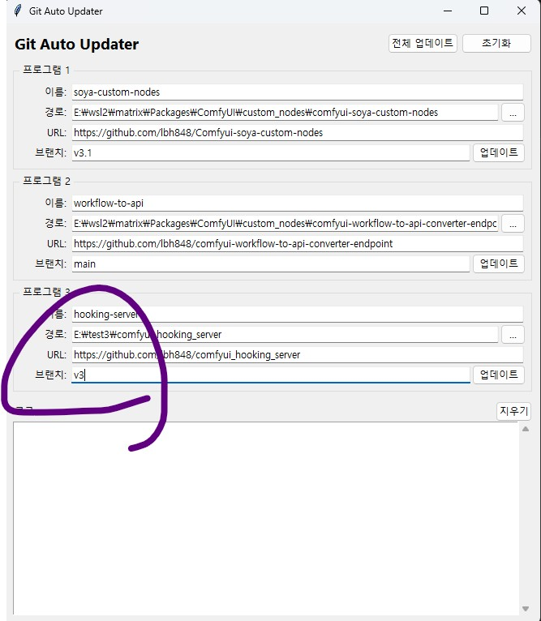

안녕?

공지 쓰는 것도 오랜만이네

알려줘야 할 사항이 있어서 공지를 쓰게 되었어

조만간 프로그램의 V4 버전을 출시할 계획이야

이에 따라 V3 지원 및 업데이트는 중단했고, 

현재까지 진행한 사항은 V3 브렌치를 생성해서 박아두었어

5월 8일 이후로는 별도의 업데이트는 없으니 이날 이후부터 공지.. 5/17 AM-04:00 

이전에 업데이트 한 사람 혹은 설치한 사람은 괜찮고

그날 업데이트 내역을 받지 못한 사람은 comfyui_hooking_server의 v3 브렌치로 바꿔서 (또한 soya-custom-nodes쪽도 반드시 v3.1 브렌치로 설정하자)

다운로드 받아서 진행하면 되

아래와 같겠네

Comfypack 사용자는 comfypack이 설치된 폴더로 이동해서 

script로 들어가서

window_update_en.bat을 실행한 뒤

window_02_install_en의 4번 메뉴를 이용해주면 되

어렵진 않으니 사진은 생략할께

---
계획중인 기능에 대해서

이 프로그램을 이용해주고 있는 만큼 

개발 방향을 공유하면 좋을 것 같아

1. 로라 학습 및 매니징 기능

2. 다른 봇 이식이 용이하도록 최적화된 감정 체인을 서치하고 만들어주는 기능(페소|DLC 목적)

3. 그 외 아래와 같은 편의 기능들

- 체인 만들때 검색할 수 있게 함

- 캐릭터 복사 기능 추가함

- Level 1 그룹 기능 추가함

- 캐릭터 부정 태그 추가

- 부정 프롬프트 미리 볼 수 있도록 개선

- 구도/기타 품질 부정 태그의 추가 버튼이 복제 버튼과 동일하게 동작하던 버그 수정

- 서버를 킬 때마다 tags.json을 asset_data 폴더에 백업(최대 10개)

- UI 정비

- config 미리보기 추가

- 에셋 이름 규칙 편의성 및 자율성 추가

- 에셋 생성시 백그라운드로 빼는 기능

- 다중 레퍼런스 이미지 기능(FACEID 성능 향상이 목적)

4. SD-studio 계열 제공 프리셋 최적화

- Comfy에서는 안먹히던 태그 제거 및 NSFW 프리셋 최적화

현 시점 언급한 것들은 구현이 된 것도 있고 아직 해야 하는 것도 있으니 

저 모든 게 구현될꺼라고는 보장은 못해주겠네 말 그대로 개발 방향으로 받아들여줘

삽화를 기대하던 사람도 있을텐데 에셋/삽화 매니저쪽이 먼저 업데이트 되겠네

삽화에서 필요한 기능이 생겨서 먼저 업데이트 준비 하는거니 너무 걱정마

(유기한거 아님, anima 정출에 따라 그림과 로라를 다시 깎고 싶어졌고, 내가 편하게 깍고 싶어서 프로그램측을 먼저 건들기로 한거임)

그럼.. 다음에 보자!

그리고 다음 버전부터는 comfy측 ray 기능이 필수가 됨에 따라 파이썬 1.13+ 지원을 종료할 계획이야, 

(v4를 보고 넘어갈지 말지 판단하면 됨, 미리 알려주는게 좋을 것 같아서 알려주는 것뿐임)

---

버그 제보/피드백은 항상 받고 있어 댓글에 남겨줘

복잡한 사항은 글을 쓴 뒤 글의 링크를 댓글에 남겨줘

문제를 해결한 케이스를 올려주면 정말 도움이 많이 되

있을지는 모르겠지만, 원한다면 프로그램 개조/편집 가능 (만들면 댓글에 남겨줘)

출처없는 프로그램 무단 도용이나, 상업적 이용은 삼가해줘