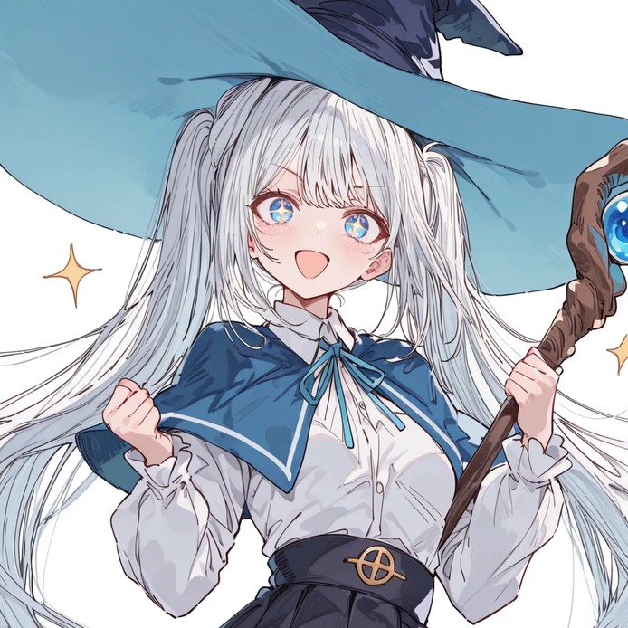

안녕?

오늘은 프로그램 버전업 관련 소식을 알려주고자 글을 썼어

아래 링크에 소개글을 썼으니 관심 있으면 구경해줘

https://arca.live/b/characterai/171709342

다행히도, 5월 17일에 V4  업데이트 관련 예고했던 내용들은 전부 반영시켰고

이외에도 여러가지를 개선해서

단순 장난감을 넘어 실제로 사용 가능한 레벨까지 프로그램을 발전시킨 상태야

더불어, 로컬의 강점 중 하나인 로라를 쉽게 만들고, 적용할 수 있게 하여

외부 캐릭터의 에셋을 만들든

너의 오리지널 캐릭터의 일관성을 보장하고 싶든

훨씬 더 개선된 이미지들을 만들어낼 수 있어

다만 이번 V4는

프리셋 구조가 바뀌었기 때문에 새롭게 설치 이사를 해야 하는 상황이야

새롭게 설치하는 것을 추천할께

또한 당분간은 베타 기간으로 둘 생각이야

이 기간동안은 업데이트가 잦고 공지 없는 패치가 종종 있을수도 있어 이용에 참고해줘

마지막으로 V3 설치 과정 중에 조금 고생했던 사람들은 

설치에 겁을 먹고 주저할 수도 있을꺼야

V4와 V3의 설치 과정은 거의 비슷하니, 

설치에 너무 겁먹지 않아도 괜찮아 (오히려 경험이 있다면 어렵지 않게 설치 할 수 있어)

또한 프로그램에서 사용자에게 문제 발생시 더 많은 정보를 제공해주기 때문에

설치 중 문제가 발생하더라도 원인 파악이 훨씬 수월할꺼야

안되면 부담없이 꼭 댓글에 말해주자

---

버그 제보/피드백은 항상 받고 있어 댓글에 남겨줘

복잡한 사항은 글을 쓴 뒤 글의 링크를 댓글에 남겨줘

문제를 해결한 케이스를 올려주면 정말 도움이 많이 되

있을지는 모르겠지만, 원한다면 프로그램 개조/편집 가능 (만들면 댓글에 남겨줘)

출처없는 프로그램 무단 도용이나, 상업적 이용은 삼가해줘