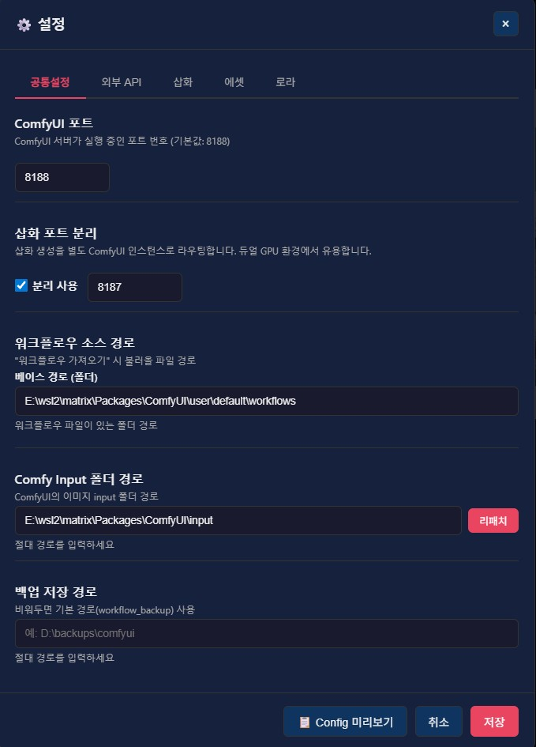

안녕?

이번에는 V4 출시일부터 지금까지 진행했던 버그 픽스 및 패치 내역을 알려주기 위해

공지를 썼어

패치 내역은 같이 동봉된 GitUpdater.exe를 이용하면 편리하게 다운받을 수 있고..

진행한 내역은 다음과 같아

1. 로라를 꺼도 트리거워드가 프롬프트에 포함되던 문제 수정

2. 삽화 워크플로우 이름 자동 완성이 안되던 문제 수정

3. 프로그램 Config 설정을 메모리 혹은 캐시에서 읽어올려고 하는 문제 수정

4. 듀얼 그래픽 사용자를 위한 삽화용 Comfy 인스턴스 분리 지원
 
---

Comfy 인스턴스 분리 지원 안내

1~3은 버그 픽스 내역이라 딱히 말해줄께 없는데

Comfy 인스턴스 분리 관련해서는 따로 말해주고 싶은게 있어서 섹션을 분리했어

듀얼 그래픽 카드 사용자라면, Comfy 두번째 인스턴스를 열어줄 때

첫번째 인스턴스가 GPU 0번을 바라보게 했다면, 두번째 인스턴스는 GPU 1번을 바라보게 해주고

두번째 인스턴스와 첫번째 인스턴스는 포트를 분리(예를 들어 8187과 8188 포트)해준 다음

프로그램 설정에서 아래와 같이 분리 사용 옵션을 활성화하고 사용하면 되

이렇게 하면, 에셋을 뽑아내면서 삽화를 그려내는 일이 가능하니까

상황에 따라 자유롭게 이용해줘

---

버그 제보/피드백은 항상 받고 있어 댓글에 남겨줘

복잡한 사항은 글을 쓴 뒤 글의 링크를 댓글에 남겨줘

문제를 해결한 케이스를 올려주면 정말 도움이 많이 되

있을지는 모르겠지만, 원한다면 프로그램 개조/편집 가능 (만들면 댓글에 남겨줘)

출처없는 프로그램 무단 도용이나, 상업적 이용은 삼가해줘