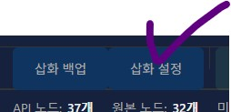
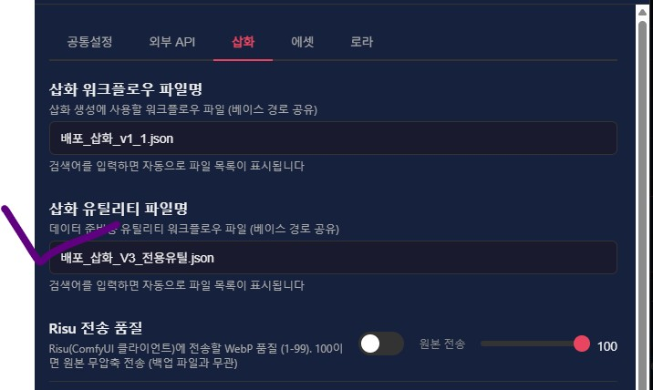
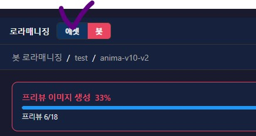

안녕?

이번에도, 5월 28일부터 지금까지 진행한

단순 버그 픽스 및 개선 관련 공지야

사용자 입장에서 중요한 이슈는 없으니

필요에 따라 자유롭게 업데이트해서 쓰면 되고

업데이트로 인한 불편함이 생기면 나한테 부담없이 말해주면 되

패치 내역은 같이 동봉된 GitUpdater.exe를 이용하면 편리하게 다운받을 수 있고..

진행한 내역은 다음과 같아

1. 공지 시스템을 브라우저 캐시 기반에서 json 파일 기반으로 수정

2. venv 기반 환경을 uv 기반 환경으로 개선(업데이트 시 라이브러리가 재설치 될수도 있지만, 신경 안써도 됨)

3. run_en.bat만 남기고 run.bat 삭제 (설치에 한글이 필요 없음)

4. 삽화 설정 탭이 추가됨, 공사중이니 신경쓰지 말기

5. 설정에서 삽화 전용 유틸리티 워크플로우 경로가 추가됨, 역시 공사중이니 신경쓰지 말기

6. 로라 매니징 탭에서 태그 모드시 마우스를 가져다 대면 해당 태그에 대한 설명이 뜸

7. 일부 UI 직관성 개선
 
---

삽화 설정 탭과 삽화 전용 유틸리티 워크플로우에 관해

삽화 워크플로우 V3 관련 프로그램에서 준비하고 싶은것들이 있어서

삽화 설정 탭과 삽화 전용 워크플로우 설정을 추가했어

별도의 튜토리얼과 워크플로우가 없으면 사용이 어렵고

아직 공사중인 섹션이니 무시하고 사용하면 되

또한 로라매니징 탭에 들어가면 에셋과 봇을 선택하는 탭이 있을꺼야
에셋을 누르면 평소같이 쓸 수 있으니까 에셋을 눌러 이용하자

---

태그 플로팅 설명과 UI 개선에 관해

이 프로그램의 로라매니징 탭에서 쭉쭉 들어가서, 테스트 이미지나 학습용 이미징의 프롬프트에 들어가면 원본과 너가 수정한 프롬프트를 볼 수 있는거 알아? (가이드에 써져있어) 

좀 더 효율적으로 작업하라고 해당 편집 모달을 개선했어

자세한 내용은 본문의 15번 섹션 업데이트 내역을 참고해줘

또한 몇몇 UI를 직관적으로 바꾸었어

근데 이건 다 조금씩 여러군데 건든거라 설명은 따로 안적을꺼고

실제로 프로그램을 쓰면서

"아 여기가 바뀌었네" 라던가 "아 뭐야 이거 버튼이였어?"
 
이렇게만 알면 될 듯

큰 차이는 없을꺼야

---

버그 제보/피드백은 항상 받고 있어 댓글에 남겨줘

복잡한 사항은 글을 쓴 뒤 글의 링크를 댓글에 남겨줘

문제를 해결한 케이스를 올려주면 정말 도움이 많이 되

있을지는 모르겠지만, 원한다면 프로그램 개조/편집 가능 (만들면 댓글에 남겨줘)

출처없는 프로그램 무단 도용이나, 상업적 이용은 삼가해줘