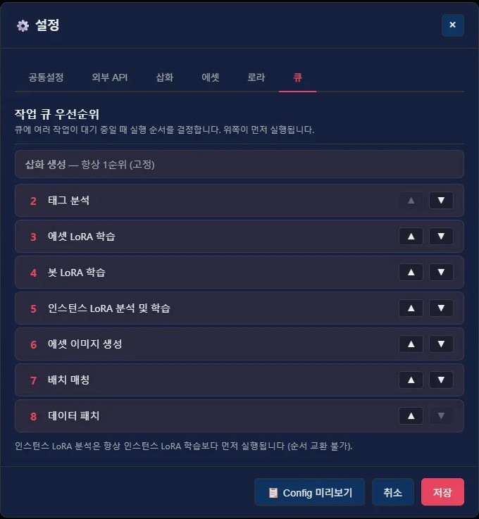
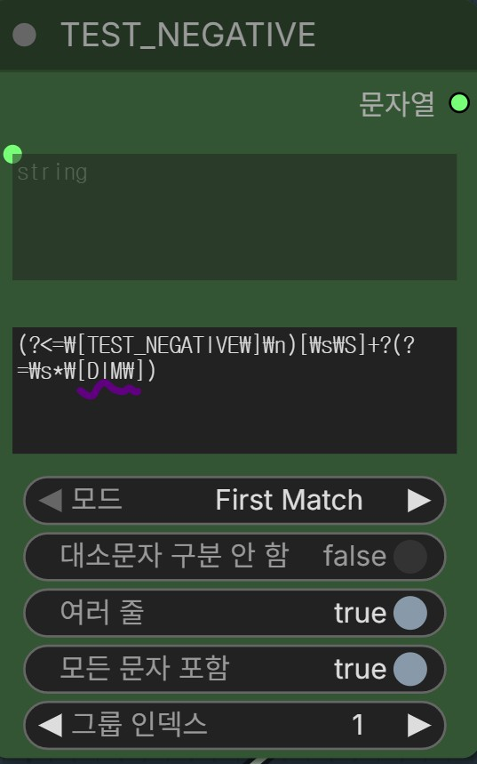
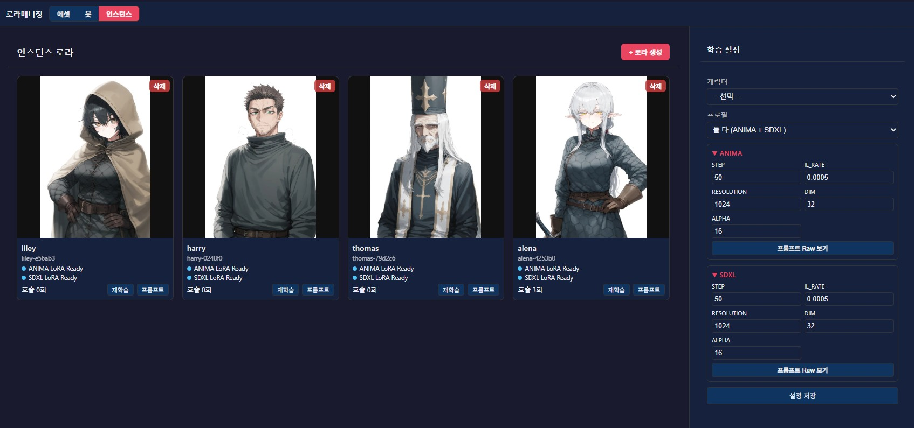

안녕?

이번에는 6월 01일부터 지금까지 진행한

나름 대형 업데이트에 관한 공지야

꽤 큰 업데이트가 포함되어 있지만

편의성 개선에 관한 내용이니

필요에 따라 자유롭게 업데이트해서 쓰면 되고

업데이트로 인한 불편함이 생기면 나한테 부담없이 말해주면 되

아마 시스템을 살짝 갈아 엎은 수준이라

내가 놓친 버그들이 있을 것 같네

패치 내역은 같이 동봉된 GitUpdater.exe를 이용하면 편리하게 다운받을 수 있고..

진행한 내역은 다음과 같아

1. 우선순위 큐 기반 작업 관리 시스템 도입

2. ILXL 학습 워크플로우 버그 개선

3. 인스턴스 로라 기능 추가

4. 추가 가이드 작성 - ANIMA만 사용하는 방법

5. 추가 가이드 작성 - 인스턴스 로라 기능 사용방법

6. 업데이트 내역 작성 - 우선순위 기반 큐 시스템에 대해

7. 로라 관련 커스텀 노드 호환성 개선

8. 로라 학습 워크플로우 베타 해제(ANIMA는 바뀐거 없고, XL은 수정사항이 있으니 다시 다운 받아서 사용할 것)
 
---

우선순위 큐 기반 작업 관리 시스템에 대해서

이름은 거창하지만, 에셋 생성에서 쓰던 큐 시스템을 프로그램 모든 섹션에 도입한거라고 보면 되

다만 에셋 일괄 생성 중에 삽화 요청이 들어오면 해당 요청을 우선적으로 처리하도록 순서를 조정하니 우선순위라는 이름이 붙은거고

설정 옆에 큐를 제어하고 볼 수 있는 버튼이 추가되었고, 
설정에서 우선순위를 조정할 수 있는 탭이 추가되었어
자세한 내용은 본문의 업데이트 내역 섹션에서 '0605 공지에서 언급한 우선순위 큐 기반 시스템에 대하여'에 써두었으니 가서 확인하자

---

ILXL 학습 워크플로우 버그 개선에 대하여

내 휴먼눅눅이슈로 인해

인자 분해에서 실수가 있었어

부정태그 분해하는 부분에서 실수가 일어난거라서, 눈치를 못채고 있었네

지금은 수정해서 프로톤에 배포_로라_학습(ilxl)_v1_1로 올려둔 상태야

이번에 업데이트된 인스턴스 로라 학습을 정상적으로 이용하고 싶다면, 해당 워크플로우 교체는 필수이니 꼭 진행하자

수동으로 고칠 사람은 다음 정규식 문항을 찾아 사진처럼 바꿔주면 되

---

인스턴스 로라에 대하여

기존 로라 생성 과정은 정교하지만,
오래걸리고, 번거로운게 흠이야

그래서 그냥 간단하게 만들어 먹을 수 있는
인스턴스 로라라는 개념을 만들어서 
프로그램에 도입했어

1분 로라랑 비슷한 느낌이라고 보면 되지만..
더 정교하고, 관리/생성/적용 과정이 훨씬 더 편할꺼야

자세한 내용은 11번 섹션, 추가 기능 둘러보기 '인스턴스 로라 사용하기' 섹션을 참고해줘

---

추가 가이드 작성에 관하여

11번 추가 기능 둘러보기 섹션에 다음 두 개의 가이드가 추가되었어
- ANIMA만 써보기
- 인스턴스 로라 사용하기

또한 15번 업데이트 섹션에 다음 설명글이 추가되었어
- 우선순위 큐 기반 시스템에 대해서

인스턴스 로라와 우선순위 큐 기반 시스템은 이미 이야기 한 내용이고... ANIMA만 써보기는 자연어만 쓰는 방향으로 가이드를 썼으니 관심있는 사람은 가서 읽으면 될듯 하네

---

로라 관련 커스텀 노드 호환성 개선

일부 사용자 환경에서는 로라 커스텀 노드(comfyui-instant-lora_v_soya)가 제대로 인식이 안되는 문제가 있어서 호환성을 개선하여 업데이트 했네

있을지는 모르겠으나, 같은 증상을 겪었지만 말 못하고 있던 사람은 업데이트 하면 이제 될꺼야

---

버그 제보/피드백은 항상 받고 있어 댓글에 남겨줘

복잡한 사항은 글을 쓴 뒤 글의 링크를 댓글에 남겨줘

문제를 해결한 케이스를 올려주면 정말 도움이 많이 되

있을지는 모르겠지만, 원한다면 프로그램 개조/편집 가능 (만들면 댓글에 남겨줘)

출처없는 프로그램 무단 도용이나, 상업적 이용은 삼가해줘