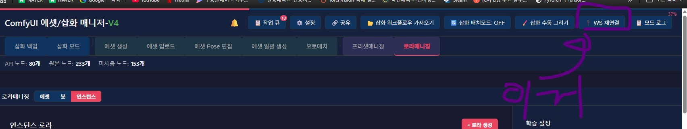
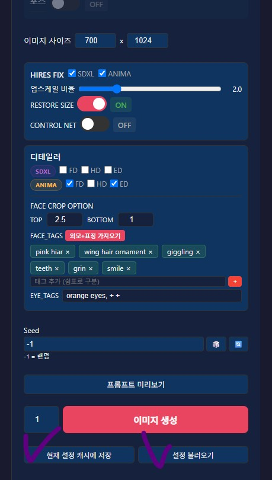
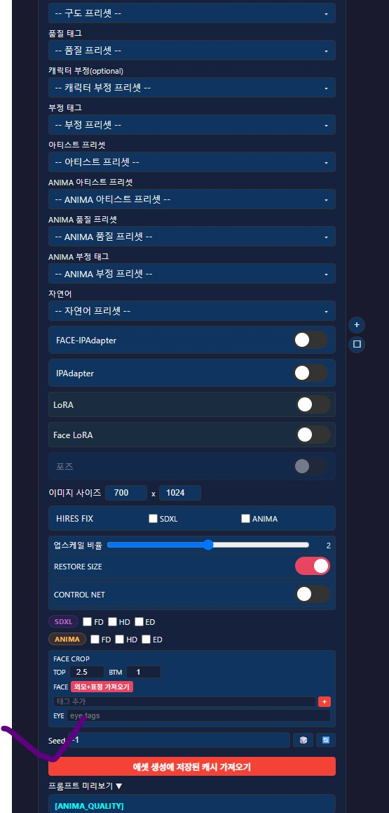
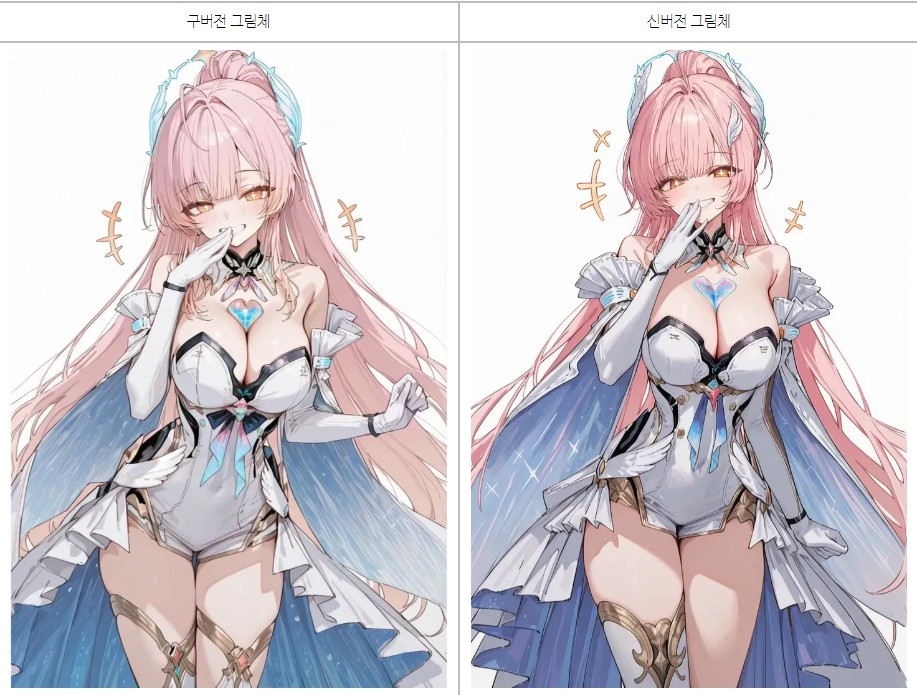

안녕?

오늘은 에셋 워크플로우 버전업 소식을 알리기 위해

공지를 썼어

에셋 워크플로우에 대해 설명하기 전에..

버그도 꽤나 많이 잡았네

다음과 같아(이 외에도 잡은게 꽤 많은데, 기록한게 이 정도야)

1. 이중 프롬프트 빌드 문제 수정, 에셋 생성시에, 프롬프트 미리보기를 복사하게 하여 그냥 근본적으로 문제를 해결함

2. 클라이언트 0명 케이스 하나 방어 및 강제 연결 버튼 추가

3. 일괄 추가시, 괄호로 묶인 태그셋이 분해되는 현상 방지

4. 일괄 생성 일괄 설정에서 IPA 관련 토글 제어시 이미지 경로가 fallback으로 안바뀌던 현상 제거 

5. 인스턴스 로라에 페이스 로라 제작 기능 추가

6. 에셋 생성에서 페이스 로라 불러오는 기능 추가

7. 프롬프트 미리보기 시각적 효과 개선

8. 에셋 생성에서 설정한 내역을 저장할 수 있는 기능 추가

패치 내역은 같이 동봉된 GitUpdater.exe를 이용하면 편리하게 다운받울 수 있지만

워크플로우 1개를 추가로 다운받고, 기존 에셋 워크플로우를 교체해야 해

- 배포_로라_얼굴_추출기_v1.json, 세팅 및 사용은 본문 11번 섹션, 페이스 로라 사용하기 참고

- 배포_에셋_anima_v2(beta).json -> 배포_에셋_anima_v2_1.json, 관련 내용은 https://arca.live/b/characterai/173612520 참고

그 외, ComfyUI에서 다음 커스텀 노드를 추가로 다운받아야 해(일부 삽화 노드가 이 노드에 의존함)

- https://github.com/sorryhyun/ComfyUI-Spectrum-KSampler

업데이트시 발생한 문제 혹은 궁금한 점은 망설임 없이 말해주면 되, 아니면 바뀐 UI에 대한 궁금증이라던가

---

이중 프롬프트 빌드 문제 수정

이전에는 에셋 생성 관련 프롬프트 미리보기를 만들기 위해, 별도의 프롬프트 빌더를 활용했으나 이러다보니 프롬프트 미리보기에 나타난 프롬프트와 실제로 comfy에서 실행되는 프롬프트가 달라지는 버그가 생겨도 못잡았었거든
이제는 그냥 단일 빌더로 통일해서 문제를 해결했네, 250606_추가공지(치명적버그픽스)에서도 안잡히는 케이스가 있다고 보고 받아서, 그냥 근본적으로 고쳐버렸어 

---

클라이언트 0명 케이스 방어 및 강제 연결 버튼 추가

가끔 진행도가 표시되었다 안되었다하는 버그가 있었을꺼야

프론트엔드와 백엔드간 연결이 제대로 안되어서 그렇다고 생각하면 되는데..

일단 눈에 띄는대로 잡고 있긴하지만, 변수가 많은 부분이여서 잡기가 쉽지 않더라고

따라서 강제 연결 버튼을 추가했어, 만약 진행도가 표시가 안된다 혹은 UI가 바로바로 반응하지 않는다 싶으면

다음 강제 연결 버튼을 눌러주면 해결될꺼야

---

페이스 로라 관련 기능 추가

인스턴스 로라 기능에서 페이스 이미지를 학습할 수 있는 기능이 추가되었어

이번에 배포한 에셋 워크플로우에서 페이스 디테일러 및 눈 디테일러를 돌릴 때

페이스 로라를 활용하도록 설계했으니까, 

캐릭터의 눈매라던지, 고유의 눈 특징, 얼굴 모양과 같은 더 자세한 정보를 디테일러에 반영할 수 있어

자세한 내용은

본문의 11. 추가 기능 둘러보기 페이스 로라 사용하기를 참고하자

---

에셋 생성에서 설정한 내역을 저장할 수 있는 기능 추가

에셋 생성 탭에서

프로그램을 껐다 킨 경우 혹은 프로그램을 재시작한 경우 이전 세팅을 그대로 가져오고 싶은 경우가 있을꺼야

브라우저 캐시에 현재 설정을 저장하고, 불러올 수 있는 기능을 추가했으니 편리하게 이용해줘

아 그리고 이렇게 저장한 캐시는 워커에서도 불러올 수 있어

사용 패턴이 보통 에셋 생성에서 캐릭터 만들고, 워커에 세팅하는 패턴인데

기억했다가 워커에서 일일히 같은 세팅으로 잡는건 귀찮은 일이니까

---

에셋 워크플로우 버전업

이번에 에셋 워크플로우를 대규모로 개편해서 업데이트 했어
그림체가 바뀌었고...
Anima만 이용하더라도 괜찮은 에셋을 만들어낼 수 있도록 anima용 디테일러들을 추가했네

이번에는 내용이 좀 많아서 따로 글을 썼어

아래 링크를 참고해줘

https://arca.live/b/characterai/173612520

그림체는 다음과 같이 바뀌었어, 

그림체 자체는 캐릭터 로라에 따라 휙휙 바뀌니까 바뀐 방향만 참고해줘

---

버그 제보/피드백은 항상 받고 있어 댓글에 남겨줘

복잡한 사항은 글을 쓴 뒤 글의 링크를 댓글에 남겨줘

문제를 해결한 케이스를 올려주면 정말 도움이 많이 되

있을지는 모르겠지만, 원한다면 프로그램 개조/편집 가능 (만들면 댓글에 남겨줘)

출처없는 프로그램 무단 도용이나, 상업적 이용은 삼가해줘