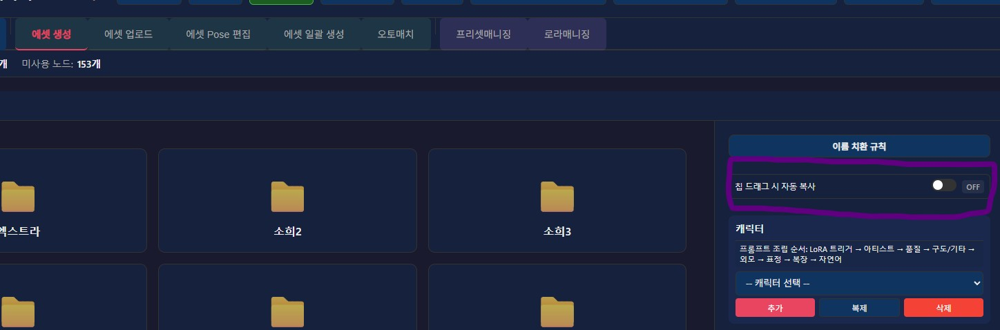

안녕?

오늘은 가벼운 업데이트 소식이야

이번에는

내가 한 거 반, 대부분 다른 사람이 남겨준 의견이나 도움을 받아서 진행한거 반

이렇게 진행했어

1. 판타지봇에 쓰기 적당한 남캐 감정 에셋 및 프리셋 배포

2. 태그칩 복사 기능 추가

3. 일괄 생성 일괄 설정 버그 대규모 픽스

4. 오토 매치 버그 대규모 픽스

5. 태그 자동 완성 기능 개선

6. 스크롤 튕김 현상 개선

7. 로라 외부 업로드 기능 추가

2/5/6/7은 다른 사람의 피드백이나 요청 혹은 직접 수정해주신 코드 받아서 작업 진행했고

3/4는 이번에 1번 작업 진행하면서 한번 쭉 찾아보고 진행했네

프로그램을 받고 개인 수정해서 써도 괜찮지만, 나와 내용을 공유하면, 

이후 업데이트에서는 해당 개조 내역이 포함되어서 업데이트가 되어서 

공유해준 챗붕이에게도 이득이니

괜찮은 개조다 싶으면 부담없이 공유해줘

(다 반영된다는 보장은 없음)

---

남캐 감정 에셋 및 프리셋 배포에 관해

이번 점검 작업을 진행하면서 겸사겸사 개인용 남캐 프리셋을 만들었는데

무난무난해서 쓸 사람 쓰라고 배포자료로 뿌렸어

감정 에셋 기준은 Give me your seed라는 봇을 기준으로 만들어졌고

내가 제공한 패치 외 attack이나, pain같은 감정셋에 대응하고자

8종의 신규 프리셋을 새롭게 만들었네

자세한 내용은 아래 페이지를 참고해줘

https://arca.live/b/characterai/173990972

---

버그 수정에 관해

버그의 경우 에셋 생성에 이런저런 옵션이 추가되었지만,

그에 의존하는 서브 시스템들이 그 업데이트를 따라가지 못하던 상태였는데 

이번 기회에 고쳤다고 보면 될 것 같아

프로그램에서 의도한 흐름

<<오토매치로 유사 감정 추출 - 에셋 생성으로 캐릭터 외형 잡기 - 에셋 일괄 생성으로 캐릭터 감정에셋 생성>>

을 따라 생성을 진행해보면서 점검해본거고

문제 있으면 말해주면 되

또한 스크롤 튕김 현상이 있는 곳이 여전히 있다고 보고 받아서

다른 분에게 코드 받아서 수정 진행했네

---

태그칩 복사 기능에 대해

에셋 생성에서 태그칩을 드래그앤 드롭으로 순서를 바꿀 수 있는거 알지?

그 동작을 수행할 때 해당 태그칩도 클립보드에 텍스트로 복사되는 기능을 추가했어

항상 켜져 있으면 불편할 수도 있으니 토글로 만들어놨어

필요하면 편하게 이용해줘

---

로라 외부 업로드 기능 추가

다른 곳에서 만든 로라를 이 시스템에 넣고 싶은 경우가 있을꺼야

스타일로라와 같이 영구적인 성격을 띄는 경우에는 그냥 워크플로우에 직접 박아넣으면 되고

프롬프트 조립 순서가 트리거 -> 아티스트 -> 품질 ... 순서라서

아티스트에 로라 트리거 워드 박아서 사용하면 되

그게 아니라 캐릭터마다 적용되는 임시적인 성격의 로라의 경우에는

이번에 업데이트 된 기능인

로라매니징 -> 인스턴스 -> 로라 직접 업로드로 진행하면 되

자세한건 본문의 업데이트 내역 -> 0618 공지에서 언급한 외부 업로드 추가 기능에 대해를 참고해줘

---

버그 제보/피드백은 항상 받고 있어 댓글에 남겨줘

복잡한 사항은 글을 쓴 뒤 글의 링크를 댓글에 남겨줘

문제를 해결한 케이스를 올려주면 정말 도움이 많이 되

있을지는 모르겠지만, 원한다면 프로그램 개조/편집 가능 (만들면 댓글에 남겨줘)

출처없는 프로그램 무단 도용이나, 상업적 이용은 삼가해줘