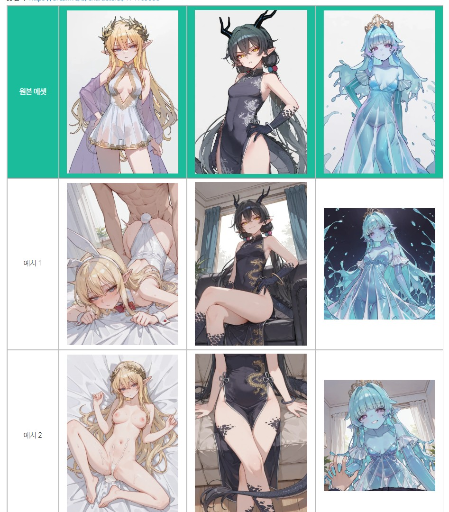
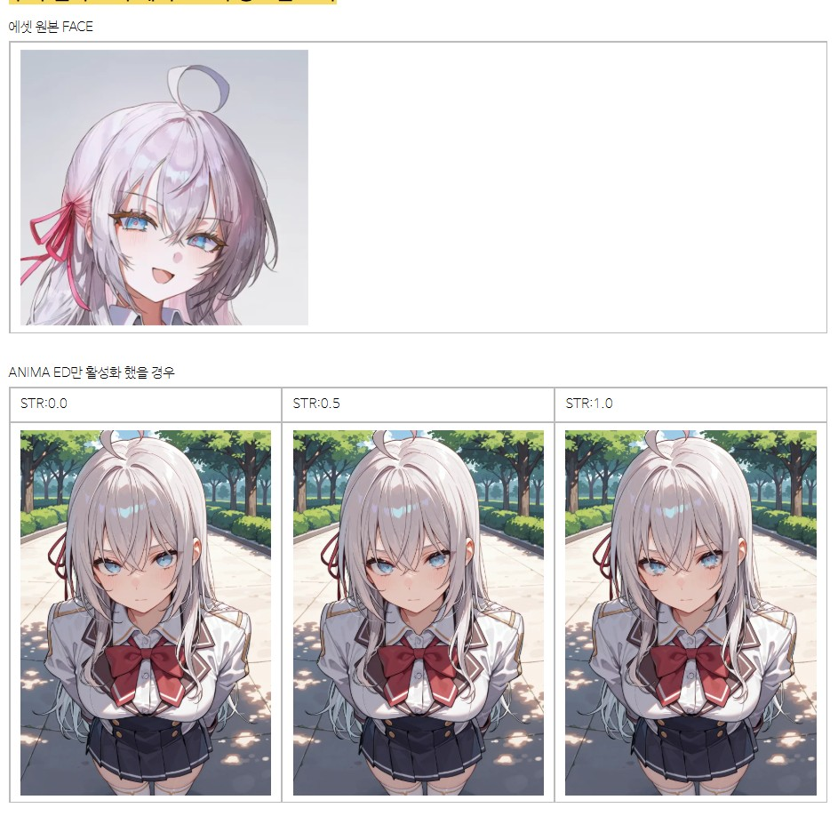

안녕?

오늘은 신기능 관련 소식이야

삽화 V3 워크플로우 및 그와 연계된 시스템을 만들어 출시했어

자세한 건 다음 글을 참고해줘

https://arca.live/b/characterai/174441916

사실 출시 자체는 21일 토요일인가 했는데..

현생이 바빠짐 & 시간 날때마다 세부적 개선을 반복하다보니 소식을 알리는게 좀 늦어졌네

이번 삽화의 컨셉은 자동 캐릭터 로라 적용이야

이 프로그램에서 쉽게 로라를 만들고, 적용 가능한것을 적극적으로 활용한 셈이지

덕분에 보통 삽화에서는 안된다고 여겨지는 1차봇 관련해서

0.8 에셋 수준으로 삽화들을 뽑아낼 수 있게 되었어

(에셋은 최적의 조합과 찐빠 검증/cowboy shot으로 제한되 구도가 들어가잖아? 그래서 0.2 깍은거야)

1차봇의 경우 일반적이면, 1인 삽화만 뽑는게 좋아 

캐릭터 로라를 여러개 쓰면 캐릭터 특징이 섞이거든

다만 요 일주일 동안 1인 삽화라고 하더라도 심심한 그림이 나오지 않도록 프롬프트를 열심히 팠어

관련 소개글에 

매니저 lb-xnai 프롬프트 세팅값-1차 싱글-v4 로 오늘 남겨놨네

또한 프로그램에서 사소한 부분들을 찾아서 개선했어,

삽화를 이용할 계획이라면 업데이트를 고려해봐(오토 업데이터 이용)

또한 요 일주일간, 삽화 모듈 불법 개조 버전을 업데이트해서 올려놨네

모듈 업데이트도 꼭 같이 진행해주자

(원본 삽화 모듈로는 찐빠가 심해서 쓰기 어려울꺼임, 꼭 내가 배포한 불법 개조 버전을 이용해주자)

2차봇의 경우 그림체에 따라 에셋과의 이질감이 생길텐데..

사실 얼굴과 눈만 에셋 그림체로 써주면 좀 더 나아지거든

예를 들어 내 그림체의 파란 눈과 에셋에서 표현하는 파란 눈은 다른 눈이지만, 

로라로 디테일을 더해주면 유사한 느낌의 파란눈을 만들 수 있는 셈이지

그리고 워크플로우 자체에서 캐릭터 페이스 분류를 진행하고 

내가 설정한 로라 및 디테일러 태그(눈색이라던가)를 적용해주기 때문에 2차 다중 캐릭터도 문제없이 가능해

덤으로 프로그램의 라이센스를 업데이트 했어

보험을 드는게 나쁜건 아니니까

CC BY-NC-SA 4.0

원저작자 표시 · 비상업적 이용 · 동일조건변경허락

이 조건이 내가 공지때마다 제시하는 조건이랑 맞더라고

마지막으로

이미 다운 받은 사람 중

이 공지를 발견하고 이 공지가 나온 날짜 이전에 다운을 받았다면, 

삽화 불법 개조 모듈과, 1인용 삽화 프리셋 업데이트, 워크플로우 교체를 추천할께(삽화 v3_1)

훨씬 나을꺼임

오늘은 뭔가 두서없는 공지가 되었네

다시 여유로워지면 또 괜찮아질테니까(더 이상 공지를 미루기 어려운 상황이였음)

다음에 또 보자

---

버그 제보/피드백은 항상 받고 있어 댓글에 남겨줘

복잡한 사항은 글을 쓴 뒤 글의 링크를 댓글에 남겨줘

문제를 해결한 케이스를 올려주면 정말 도움이 많이 되

있을지는 모르겠지만, 원한다면 프로그램 개조/편집 가능 (만들면 댓글에 남겨줘)

출처없는 프로그램 무단 도용이나, 상업적 이용은 삼가해줘