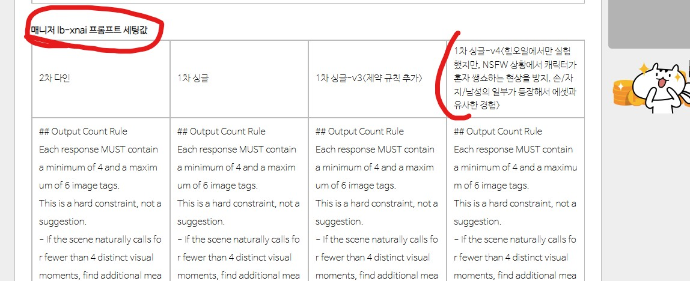
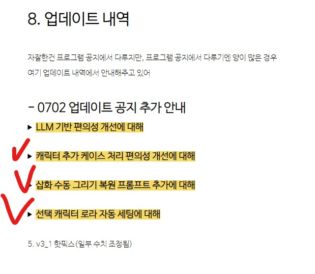
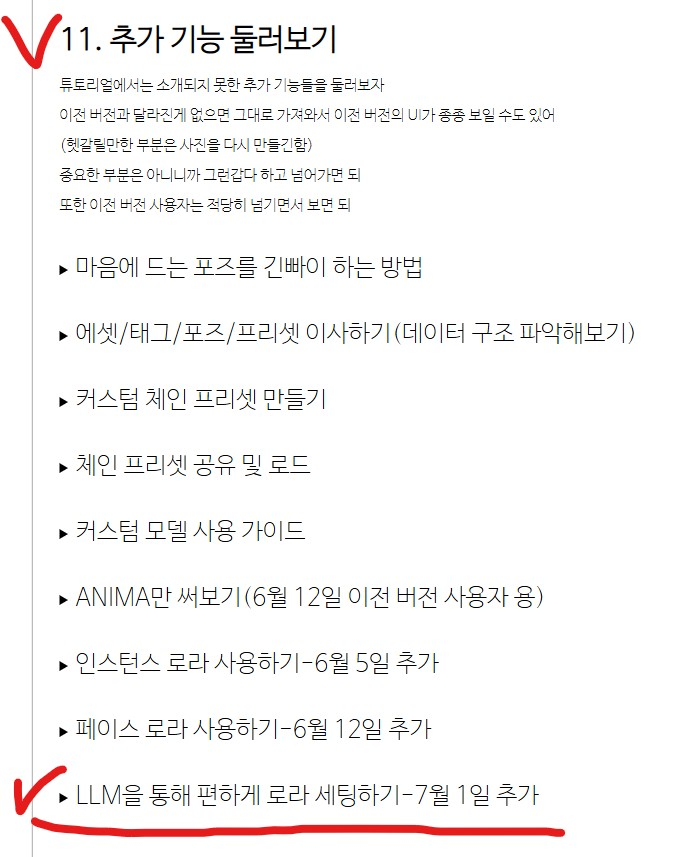
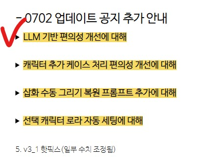
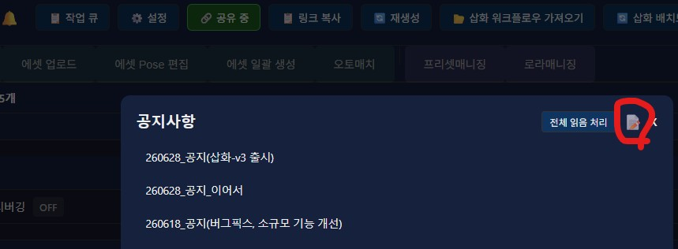

안녕?

오늘은 편의성 기반 대형 업데이트 소식이야

비전 인식이 되는 LLM을 기반으로
짜증나는 부분들(Ex. 로라 태그 세팅)의 난이도를
대폭으로 감소시켰어

LLM관련해서는 내용이 많아서 매니저 V4 소개글이랑 삽화 워크플로우 V3 소개글에 나눠서 작성했으니까 공지에서는 어디에 어떤 내용이 있는지만 간략하게 안내 진행할께

또한 삽화 관련해서 다음 3개의 개선이 있었어
1. 삽화 워크플로우 일부 파라미터 조정

2.  삽화 불법모듈개조 버전업 안내

3. lb-xnai 시스템 프롬프트 프리셋 안내

이건 따로 글을 작성하지는 않으니까 공지에서 조금 자세하게 안내해줄께

---

삽화 워크플로우 일부 파라미터 조정에 관해

삽화 v3_1에서 일부 수치가 잘못되어 있어서 고쳐서 다시 올렸어

(배포_삽화_v3_1(beta)_hotfix.json)

다운 받아서 써도 되고 혹은 Eye State Detector (Soya)라는 노드에서 (총 3군데)
eye_seg_th가 0.8로 되어 있을텐데
이 값은 너무 높은 값이니까, 0.5정도로 낮추도록 직접 고쳐도 되

다운 받을꺼라면 다음 프로톤 링크에 가서 다운 받아서 쓰도록 하자

https://drive.proton.me/urls/RS0Y2NTZZ8#G8r7ZkL69xz9

---

삽화 모듈 불법 개조 개선에 관해

6월 22일인가, 

삽화 붎법 모듈의 개선 버전을 올려둔 상태였고 따로 안내는 없던 상황이였는데..

안정성을 보느라 알려주는게 좀 늦었네

이번 기회에 정식으로 안내할께

다운받을꺼라면 다음 프로톤 링크에 가서 다운받아 쓰도록 하자

soya_0622update 되어 있는거 쓰면 되

https://drive.proton.me/urls/VCVXPXN18M#pU3alCDwURvh

또한 로컬 모델들은 파싱 형식을 약간 틀리게 출력하는 경우들이 있더라고

이 경우에는 이미지가 한장만 파싱되거나 하는 문제점들이 있는데..

이건 라이트보드 본체를 고쳐야하는 문제라 결국 라이트보드 본체를 불법개조했네

원한다면, 

라이트보드 - 3.4.0-soya-0702.module.charx 다운받으면 해결될꺼야

라이트보드는 후처리 알고리즘만 살짝 개선한거라

필수가 아닌 옵션이야

---

lb-xnai 시스템 프롬프트 프리셋 개선에 대해

마지막으로 삽화 시스템 프리셋 V4 버전을 올려놨었는데
이것도 따로 안내를 안했더라고...
지금 정식으로 안내할께

아래 ComfyUI 삽화 워크플로우-V3(1차 봇 단일/2차 봇 다인 일관성 강화) 소개글(
https://arca.live/b/characterai/174441916
)

에서 1번 섹션 다운 링크 및 프리셋으로 들어가서 매니저 lb-xnai 프롬프트 세팅값 -> 1차 싱글-v4 긁어가면 되

V3 버전은 혼자 쌩쇼하는 느낌이였다면, V4 버전은 손이나 남자 몸통 일부가 나타나니, 삽화 주제에 훨씬 에셋 다운 느낌이 나거든

---

삽화 편의성 개선 안내

아래 3개의 기능이 개선되었어

1. 캐릭터 추가 케이스 편의성 개선

2. 삽화 수동 그리기 복원 프롬프트 추가(봇 기반)

3. 캐릭터 로라 자동 세팅 기능

아래 삽화 워크플로우-V3 소개글(https://arca.live/b/characterai/174441916)에서

업데이트 내역 -> 0702 업데이트 공지 추가 안내를 참고하자

---

LLM 기반 대형 업데이트 안내

일단 매우 편해졌고..

내용도 꽤 많거든

먼저 로라 관련해서 V4 매니저 본문에 소개해두었어

11번 섹션 추가 기능 둘러보기 -> LLM을 통해 편하게 로라 세팅하기를 참고하자

그 다음, 삽화 관련해서도 LLM 관련 요소들이 추가되었거든

삽화 V3 소개글(https://arca.live/b/characterai/174441916)에서

업데이트 내역 -> 0702 업데이트 공지 추가 안내를 참고하자

---

PS. 프로그램 팁

매니저 소개글에 쉽게 접근할 수 있는 방법에 대해 잠깐 알려줄려고 

V3 시절에 공지했었지만 모르는 사람이 있을수도 있으니까

프로그램 공지에서 아래 버튼으로 편하게 접근할 수 있어

---

앞으로의 진행방향에 대해

챈섭도 그렇고, 그림체 로라에 대한 수요가 좀 생길 것 같아서

단기적으로는 프로그램적으로 그림체 로라를 만들고 추출할 수 있는 기능을 만들 생각이야

그 다음으로는 지금 방향처럼 계속 안정화 및 사용 경험 개선을 진행할껀데...

저어번에 진행방향 이야기 할 때 Comfypack에 준하는 편한 무언가를 만들어낸다고 했었잖아?

안정화와 동시에 그 편한 무언가를 만드는걸 천천히 진행할 것 같네(Comfypack 배포 경험으로 미루건데, 도커는 별로였음, 뭘하면 좋을지 감이 안잡히네.. 흠..)

이건 내가 여유있을 때 천천히 진행하는거니까
피드백, 혹은 원하는 기능 요청이 들어오면 그걸 더 높은 우선 순위로 둘 생각이야

버그 제보 환영이고

사용/업데이트 혹은 설치 과정 중에 문제 생기면 그냥 cmd 긁어서 알려주면 되(프로그램과 Comfy 둘다), 답변 기다리는게 서로 번거로우니 아예 처음부터 정보를 최대한 많이 덤프해버리면 내가 거기서 파서 추측해볼께

---

버그 제보/피드백은 항상 받고 있어 댓글에 남겨줘

복잡한 사항은 글을 쓴 뒤 글의 링크를 댓글에 남겨줘

문제를 해결한 케이스를 올려주면 정말 도움이 많이 되

있을지는 모르겠지만, 원한다면 프로그램 개조/편집 가능 (만들면 댓글에 남겨줘)

출처없는 프로그램 무단 도용이나, 상업적 이용은 삼가해줘

CREATIVE COMMONS-CC BY-NC-SA 4.0