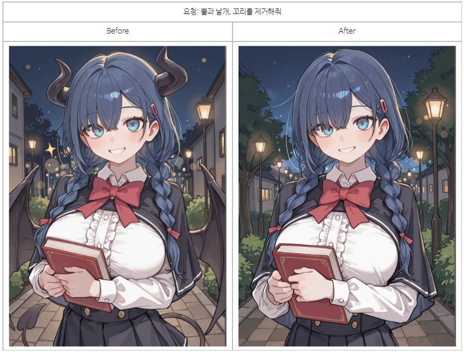
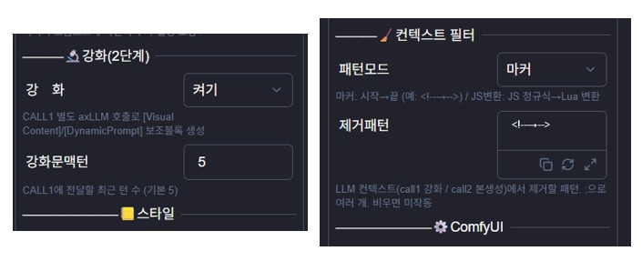
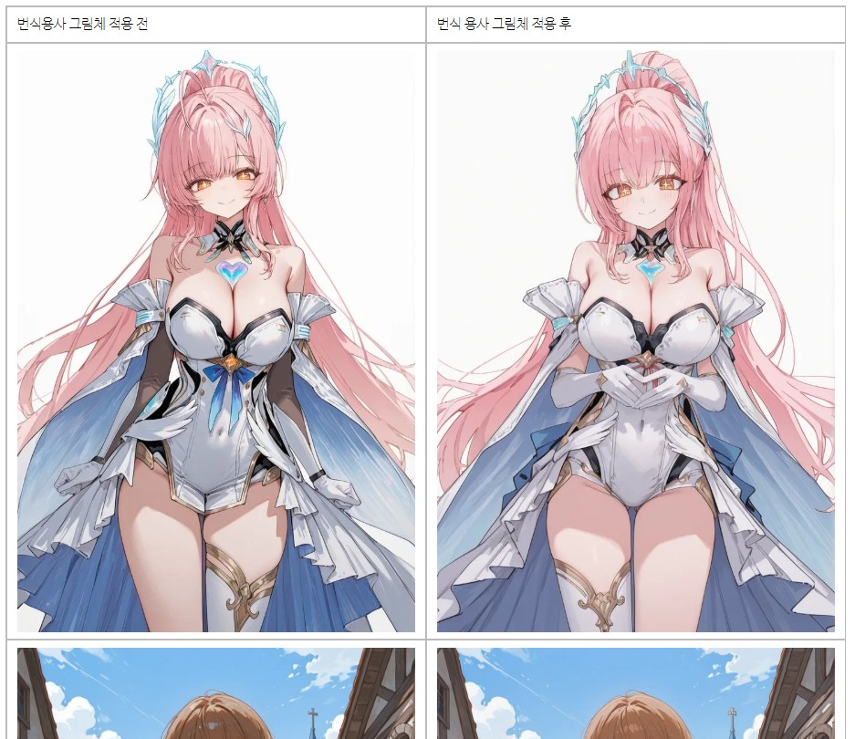

안녕

오늘은 저번에 말했던 그림체 로라 업데이트를 가져왔어

또한 LLM 기반 삽화 재생성 프로세스를 개선하고
불법 개조 삽화 모듈을 개조하고
여러 잡버그를 잡는 등 여러가지 일을 수행했네

정리하면 다음과 같아

- 외부 API 설정 개선(LLM2 활성화 및 작업별 LLM 분기 기능)
- 삽화 이미지 재생성 및 관리 프로세스 개선
- 삽화 모듈 불법 개조 개선
- 삽화 모드 개선
- 그림체 로라 추가
- 그외 기타 잡다한 버그 및 로직 개선

이번에는 업데이트 글을 따로 작성했어

지금 프로그램은 점차 안정화 되고 실용적으로 변하가는 것 대비

소개글은 중구난방으로 변해가는 느낌인데

아마 나중에 쉬운 설치 버전이 나오기 직전까지 계속 업데이트를 쌓아두다가 

한번에 쫙 정리할 것 깉네

그 전에는 댓글로 물어보면 성실하게 알려줄테니

궁금한거, 문제있는건 언제든 물어봐도 되

여기에서는 주요 업데이트만 간략하게 보여줄테니까

자세한 내역, 업데이트 방법에 관한 건

아래 링크의 글을 참고해줘

https://arca.live/b/characterai/176676535

참고로 이번 업데이트에서는 스타일 로라 추가로 인해

워크플로우 2개를 교체하는 작업과 워크플로우 2개를 추가하는 작업이 요구됨을 알고

업데이트를 진행해줘

---

삽화 이미지 재생성 및 관리 프로세그 개선에 대해

삽화 모듈의 생성 결과가 마음에 안 들때, 태그 충돌로 인해 신체 뒤틀림 등이 발생했을 때
비전 기반 LLM으로 사용자의 요청, 그림의 문제, 충돌 태그를 분석해서 원하는 방향으로 태그를 다시 만들고
그림을 재생성하는 기능이야

V3 계열 삽화 워크플로우 및 V1 계열 삽화 워크플로우 모두 지원하니까 마음껏 사용해보자

---

삽화 모듈 불법 개조 개선에 관해

다음 글에 있는 조각 프롬을 삽화 모듈에 흡수했어
https://arca.live/b/characterai/174995748

차이점은 태그 추출 직전에만 임시로 강화 컨텍스트를 넣어서

타 플러그인, 모듈과의 호환성 문제를 해결하고, 메인 응답 컨텍스트가 오염되는 걸 방지했다는거

또한 컨텍스트 필터라는 걸 추가했어

봇이나 플러그인들은 본문에 각종 흔적을 남기는데, 이러한 것들이 태그 추출용 컨텍스트에 들어가봐야

좋을 것이 없거든

어떻게 하면 가장 깔끔하고 단순하게 분리할수 있을지 고민하다가

기가트랜스 모듈에서 힌트를 얻었네

이 프로그램에만 쓰기 아까울 정도로 

깔끔한 모듈 개조를 진행했으니

NAI나 챈섭 등을 사용하더라도, 한번 츄라이해봐

(기존에는 삽화 LLM이 파싱 형식을 맞춤과 동시에, 상황을 분석하고 태그를 추출하느라 많이 타율이 낮았는데, 미리 힌트를 던져주니 타율이 체감될 정도로 개선됨)

---

그림체 로라 추가에 대해

이번 업데이트에서 그림체 로라라는 기능이 추가되었어

기존 로라와 가장 큰 차이점이라면.. 학습 단위가 몇 백장 이상이고, 다양한 캐릭터의 학습이 들어간다는 점

내가 제공하는 기존 로라 학습 워크플로우로는 소화가 안되는 단위라서, 별도의 그림체 로라 학습 워크플로우를 제공했어(업데이트 글 참고)

비전 기반 LLM을 통해 태그 정제 작업 자체는 거의 자동화 되어있는 상태고

에셋이랑 봇 양쪽에서 모두 불러오는데 문제 없어

다만 내 경험이 부족해서, 최적화된 학습 파라미터는 좀 더 연구해봐야할듯

이건 추가가이드에 들어갈만한 내용이라서, 매니저 V4 소개글 본문 -> 11번 섹션(추가기능 둘러보기)에서, 그림체 로라 학습하기를 확인해보면 되

---

앞으로의 진행방향에 대해

이제 다음은 쉬운 설치 버전에 대해 고민해볼 것 같네

다만 Comfy pack 배포 경험으로 미루어봤을 때

미리 프로그램을 안정화시키지 않으면 일이 두배가 되거든?
(하나 만들어두면 배포를 위한 작업을 또 해야 함)

그래서 당분간 안정화 및 로직 개선에 집중할 듯

---

버그 제보/피드백은 항상 받고 있어 댓글에 남겨줘

복잡한 사항은 글을 쓴 뒤 글의 링크를 댓글에 남겨줘

문제를 해결한 케이스를 올려주면 정말 도움이 많이 되

있을지는 모르겠지만, 원한다면 프로그램 개조/편집 가능 (만들면 댓글에 남겨줘)

출처없는 프로그램 무단 도용이나, 상업적 이용은 삼가해줘

CREATIVE COMMONS-CC BY-NC-SA 4.0