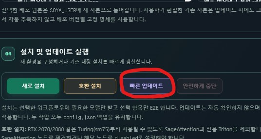

안녕

뭘 빼먹었나 했더니, 업데이트 금지 공지를 올려두고 방치했더라고..

정말 미안... 고의는 아니였음

V5 버전이 나왔어, 

여기에서.. 설명하기엔 내용이 좀 많네 

번거롭겠지만 직접 가서 봐줘

정말 많은게 바뀌었으니 한번 구경해보면 좋을 것 같아

https://arca.live/b/characterai/179146903

그리고, 이미 V5 설치한 사람들도, 한번 더 업데이트 부탁할께

기능 구현이 끝나 시간 여유가 생긴 만큼 이번에 LLM 프롬프트를 다듬을 시간을 가질 수 있었고

그 결과 몇몇 심각한 찐빠를 가진(대표적으로 테스트 이미지 세팅) 프롬프트들을 수정할 수 있었어

무엇보다 삽화 프롬프트 상태가 생각보다 심각했는데

LLM에게 맡기지 않고, 직접 검수해서, 어느 정도 수리해둔 상태야

아마 캐릭터가 자꾸 외모 태그나 복장 태그를 빼먹어서 짜증났을텐데

이젠 그런 문제들은 고쳐진 상태라고 보면 될듯

또한 TAILSCALE 기반으로 고정 주소를 받는 기능이라던가

일괄로 대표 이미지를 설정하는 기능 등 피드백 받은 기능들을 추가했어

V5 이용자 중 업데이트 해서 손해볼 것은 없으니 업데이트 부탁할께

업데이트는 설정 -> 업데이트 및 설치 -> 빠른 업데이트를 통해 진행하면 되

---

업데이트 시 참고 사항

만약 업데이트 중 ./bin 폴더 때문에 업데이트 안된다고 뜨면, 

해당 폴더 삭제 후 업데이트 해주면 되 

업데이트 된 프로그램에는 저 폴더를 무시하도록 설정되어 있으니 이번만 좀 번거로움을 감수해주면 될 듯(안떠도 정상임, 컴퓨터 환경에 따라 생기느냐 마냐가 결정되는 폴더라서) 

현재 댓글로 피드백 받은 것 중 다음은 아직 못한 상태야
- SDStudio 프리셋 변환기 내장
- 워크플로우 선택 가이드 작성
- 수동 설치 가이드
- 리눅스 확장(이건 우선 순위가 낮음)

그 외 나머지는 다 처리한 상태이니

확인해보고 누락되어 있으면 말해줘

---

버그 제보/피드백은 항상 받고 있어 댓글에 남겨줘

복잡한 사항은 글을 쓴 뒤 글의 링크를 댓글에 남겨줘

문제를 해결한 케이스를 올려주면 정말 도움이 많이 되

있을지는 모르겠지만, 원한다면 프로그램 개조/편집 가능 (만들면 댓글에 남겨줘)

출처없는 프로그램 무단 도용이나, 상업적 이용은 삼가해줘

CREATIVE COMMONS-CC BY-NC-SA 4.0