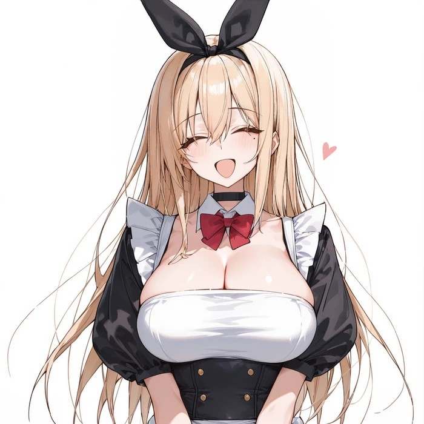

안녕

업데이트 소식을 전하기 위해 글을 썼어

큰 내역은 없지만 영상 관련해서는 많은 개선이 있었고, 

영상에 이미지 레퍼런스(I2V랑은 다름)를 넣을 수 있는 워크플로우와 모드가 추가되었으니 이용해보자

앞으로 추가되는 V5관련 업데이트 내역 혹은 가이드는 아래 링크에 추가될 예정이야

이번 업데이트 역시 본문까지 갈 필요 없이 아래 글에서만 확인해도 무방해

https://arca.live/b/characterai/180736415

따로 글을 판 대단한 이유는 없고 본문에 더 내용을 넣고 싶어도 용량 한계에 부딪혔는지 에러가 나더라고...

편하게 보라고 시리즈에 포함시켜놨으니까 큰 불편은 없을꺼야

이번 메이저 업데이트 외에도 다음 사항들이 개선되었어

1. 업데이트 로직 개선(사용자의 변경 내역이 있더라도 그걸 백업하고 업데이트 수행)

2. ML 패키지 의존성 문제 해결

3. UI 위치 조정(큰 건 아니고 겹쳐서 사용이 불편한 부분 같은것만 위치 이동)

4. 버그 픽스

피드백 준 것들은 아직 반영하지 못한 상태야

즉 말해준 내역이 있어도 이번 업데이트에서는 빠져있을 수도 있어

아마 다음 업데이트에서는 새로운 기능 추가보다는 이미 있는 기능의 사용감을 개선하는데 집중할 듯

---

버그 제보/피드백은 항상 받고 있어 댓글에 남겨줘

복잡한 사항은 글을 쓴 뒤 글의 링크를 댓글에 남겨줘

문제를 해결한 케이스를 올려주면 정말 도움이 많이 되

있을지는 모르겠지만, 원한다면 프로그램 개조/편집 가능 (만들면 댓글에 남겨줘)

출처없는 프로그램 무단 도용이나, 상업적 이용은 삼가해줘

CREATIVE COMMONS-CC BY-NC-SA 4.0