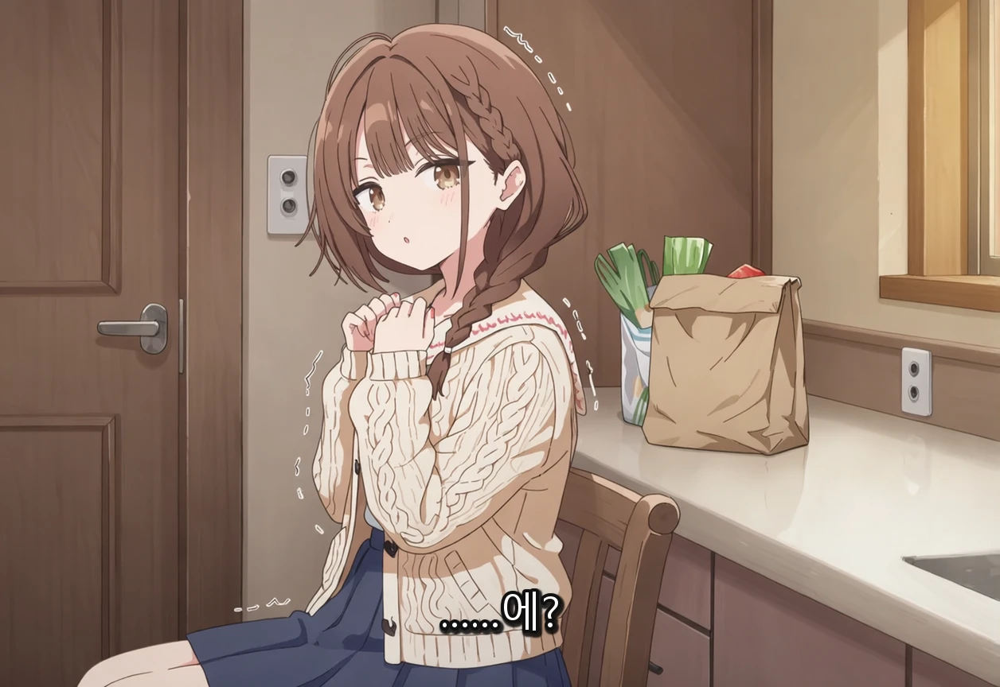
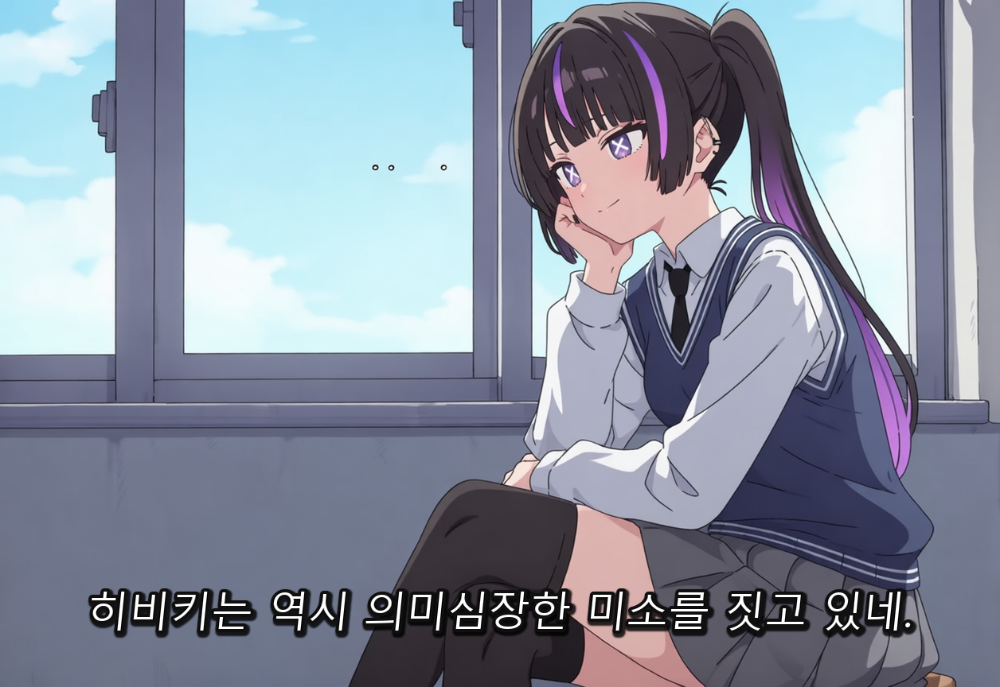
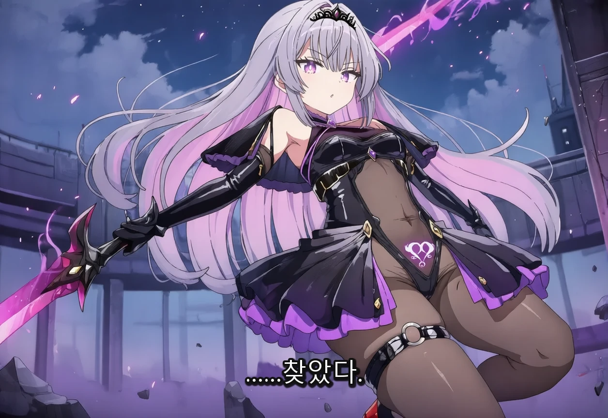
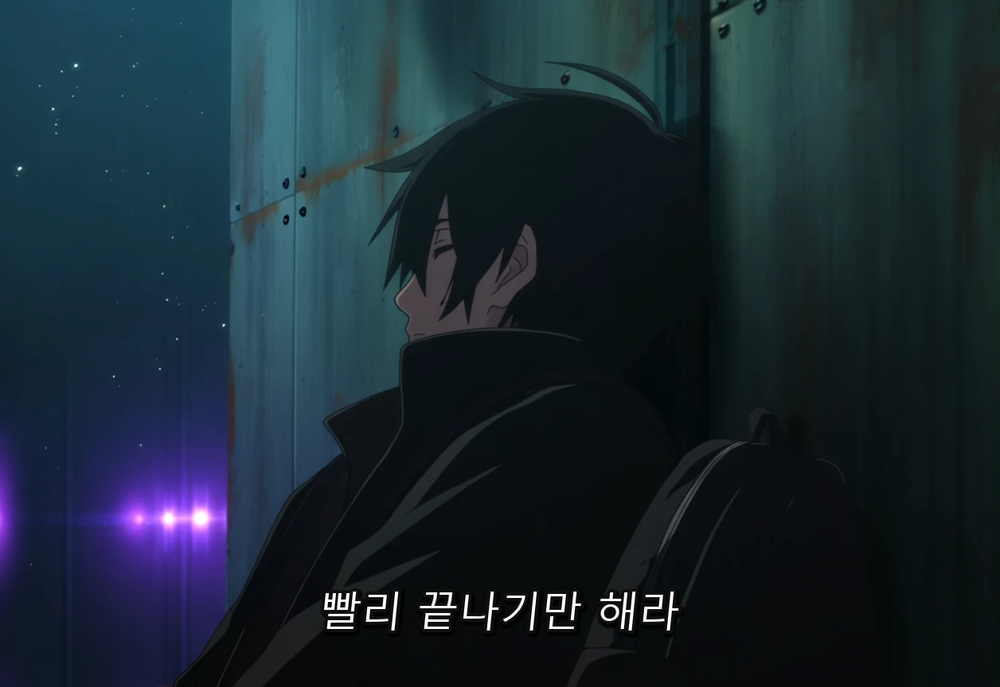

안녕

업데이트 소식을 전하기 위해 글을 썼어

사실 30일쯤에 업데이트 자료는 올렸는데

갑자기 바빠져서 마무리 작업을 못하고 있다가

겨우 할까 싶은 타이밍에 운 좋게 버그 리포트들이 들어와서

고치고 업데이트를 진행했네

또 이 프로그램의 삽화 시스템에서 백엔드로 쓰고 있는 라이트보드도 4.2.0으로 막 업데이트 되었기에 바로 대응하기도 했고..

여러모로 타이밍이 좋았던거 같아

이 대묻도 

업데이트 내역을 정리하면 다음과 같아

- 삽화에 멀티 프로필 기능이 추가, <비욘드 디스페어 같이 캐릭터 하나가 상황에 따라 외모 / 복장이 바뀌는 경우를 케어할 수 있게 되었네>

- 에셋을 삽화 시스템을 통해 출력<다만 이건 내 개인적 필요에 따라 만든 것 뿐이라서 그냥 이용할 사람만 이용하면 되>

- 카메라 구도 조정 기능이 추가 <다만 내 프로그램에서는 태그를 빡빡하게 밀어넣으니 효과가 상당히 떨어지는 장난감 같은 기능이야>

- 삽화의 편하게 수정 기능에 /goal 같은게 추가, <그냥 목표를 이룰때까지 수정하는 기능이라고 보면 되, 난 오토피드백이라고 이름을 붙였네>

- 애니메이션 스타일 영상 계획 프로세스 추가 < 영상은 연속적인 흐름을 보여주니 마음에 안드는 구석이 있더라고 그래서 프로세스를 좀 개선한거야>

- 그림체 업데이트 / 속도 개선 <anima 쪽은 완전히 바뀌어서 애니메이션 스크린샷 스타일이라고 보면 되, sdxl + ILXL 쪽은 이전과 비슷한 대신 속도가 대폭 개선되었고>

- lb-xnai.lb.extra 구조에 배포 1차 싱글 V5가 추가되었어, 그냥 V4랑 목표는 같은데 충돌 지침을 수정한 버전이라고 보면 되

- 자막 후처리 모드가 추가 <대사박스도 싫고 만화도 싫은데 인물 대사는 보고 싶다 싶으면 한번 써봐 영화에 들어가는 자막 스타일로 삽입해줘>

- anima 2.9b 대응 <보통 anima 보다 레이어가 더 깊어서 연산은 더 걸리지만 최신 컷오프를 지원하고 인체 이해도가 좀 더 높아진? 기분이야, 이 프로그램에서 만드는 로라는 모두 대응되니 부담없이 이용하면 되>

- 그외 각종 버그 픽스, 삽화 프롬프트 개선.. 등등 전반적으로 완성도를 높였네

업데이트 시 주의점은 다음과 같아

- 라이트보드가 4.2.0으로 업데이트 되었어, 이 프로그램은 라이트보드 시스템을 이용해서 리스에 삽화를 표시하니 백엔드 업데이트를 잊지 말자

- 삽화 관련 모듈과 플러그인이 업데이트 되었어, 업데이트 후 사용해주자

- 이번에 v4 워크플로우 팩이 배포되었어, 기존 사용자는 새로운 워크플로우만 가져가면 되

- 워크플로우 그림체가 바뀜에 따라 새로운 아티스트/품질/부정 프리셋이 필요하게 되었어. 이 프로그램의 일괄 생성에서 체인 로드 시스템을 이용하면 프리셋을 가져갈 수 있게 되어 있기에 이번에는 이 방식으로 프리셋 세트를 배포할 생각이야 자세한건 가이드를 참고해줘

- 이전에 배포했던, REF2V 워크플로우 시스템에 문제가 있어서 다시 만들었어, 혹시 가져갔었던 사람은 기존 워크플로우를 삭제하고, 이번 V4 팩에서 다시 가져가도록 하자

자세한 업데이트 내역과 업데이트 방법은

본문에 갈 필요 없이 아래 글 보고 확인해보면 되

https://arca.live/b/characterai/180736415

---

그림체 업데이트에 대해서

오랜만에 그림체를 업데이트 했어

특히 이번 anima 전용 삽화 그림체의 경우, 이번에 같이 업데이트 된 자막 후처리 모드와의 궁합이 좋아

한번 이용해보는걸 권장할께

아래는 anima 전용 삽화 그림체야

봇은 beyond despair 봇

---

앞으로의 진행방향에 대해

조만간 곧 바빠질 예정이야(사실 이미.. 꽤 바빠..) 

그로 인해, 이전처럼 적극적인 대응이 어려워질지도..

그래서 이번 업데이트에 하고 싶었던걸 조금 급하게 넣었어

바빠지기 전에 후딱 끝내고 싶었거든

다만 버그 리포트는 부담없이 언제든 해줘도 되

그정도는 배포자로써 책임감을 가지고 계속 케어해볼께

이번에 PR 준 사람도 있는데

이번 업데이트에서는 반영 못했어

이 PR 만큼은 서둘러서 반영할 수 있도록 해볼께

---

버그 제보/피드백은 항상 받고 있어 댓글에 남겨줘

복잡한 사항은 글을 쓴 뒤 글의 링크를 댓글에 남겨줘

문제를 해결한 케이스를 올려주면 정말 도움이 많이 되

있을지는 모르겠지만, 원한다면 프로그램 개조/편집 가능 (만들면 댓글에 남겨줘)

출처없는 프로그램 무단 도용이나, 상업적 이용은 삼가해줘

CREATIVE COMMONS-CC BY-NC-SA 4.0