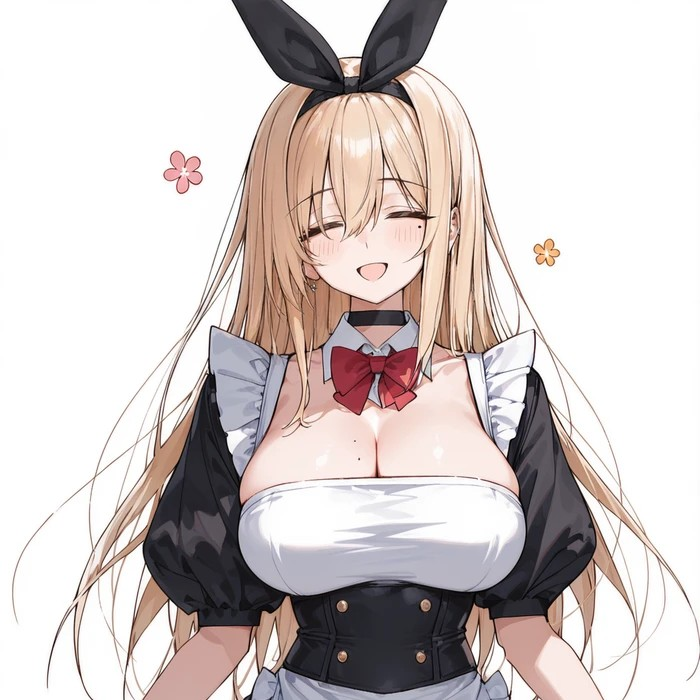
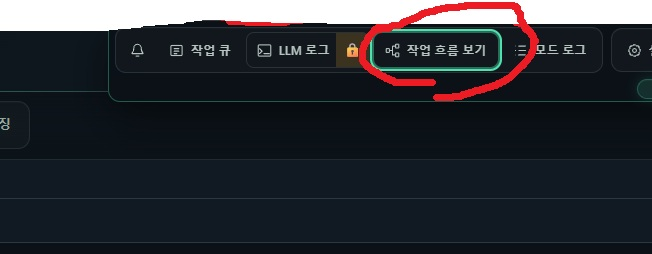
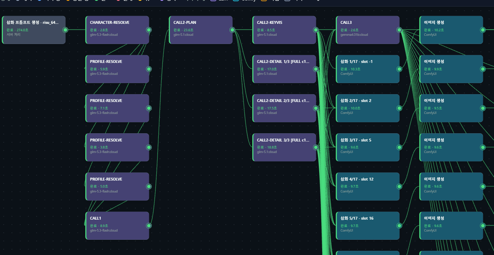

하이

업데이트 소식을 전하기 위해 글을 썼어

우선.. 근 2주간 제보 받은 버그 고치고 PR건 반영했어 (반영해놓고 업데이트를 못하고 미루고 있었음 ㅈㅅㅈㅅ)

그리고.. 재미있는 논문을 발견했고(FreeFuse: Multi-Subject LoRA Fusion via Adaptive Token-Level Routing at Test Time),

여기 나온 이론을 기반으로 다인 삽화를 극적으로 개선해둔 상태야

이제는 고유의 캐릭터 로라를 지닌 캐릭터 여러명 있다고 해서 삽화 그림체가 풍화되거나 캐릭터가 섞이지 않음

로라 강도도 조절할 필요 없이 그냥 1인 로라와 같은 강도로 두면 되

리저널 기반 다인 삽화는 계속 문제였는데 이젠 대부분 해결된 듯,

또한 작업 흐름을 그래프 노드로 라이브로 볼 수 있는 기능을 만들었어

생각보다 많은 사람들이 잘못된... 성능으로 쓰고 있는거 같더라고

직접 흐름을 보면서 LLM 호출을 최적화해보라고 만든 기능이니까 많이 써줘

오케스트레이션을 쓰는 삽화와 영상에 대해서만 노드가 활성화되어 있는데 그 외 원하는 작업이 있다면 요청해줘, 당분간 소소하게(강제) 업데이트할 것 같으니 직접 개조해도 되고

삽화 프롬프트도 훨씬 좋게 개선해 둔 상태야, 애매한 지시를 싹 다 교체했어

이번 업데이트에 맥 지원이 포함되었는데.. 사실 테스트 해본게 아닌 순수 PR에 의존해서 넣은거라 안될 수도 있어

이번 업데이트 관련 내역은 본문까지 갈 필요 없이 아래 글에서만 확인해도 무방해(사실 이 공지만 봐도 될듯, 별거 없어서)

https://arca.live/b/characterai/180736415

삽화 모듈과 플러그인 버전도 올라갔으니 다시 세팅해주자

---

자세한 업데이트 내역

코덱스의 힘을 빌려 좀 더.. 자세한 설명을 넣어놨어

나는 귀찮아서 이렇게 못 쓰는데 글 잘 쓰네

중간에 나온 자동 검사 기능의 경우 이미지당 LLM 호출 한번에 마지막 전체 검사도 한번 추가되니 프롬프트 개인 개조 할 사람 아니면 키지 않는게 좋아(기본 꺼짐)

- 삽화와 영상의 작업 흐름을 직접 볼 수 있게 되었어 <지금 어떤 단계가 진행 중인지, 어떤 LLM이 일을 맡았는지, 어디에서 멈췄는지를 상단의 `작업 흐름 보기`에서 확인할 수 있어. 문제가 생겼을 때 원인을 찾기도 훨씬 편해졌네>

- 삽화 생성 과정을 전반적으로 개선했어 <복잡한 자세나 신체 접촉, 화면 밖 인물과의 상호작용, 카메라 구도, 장면 사이의 복장 연속성을 이전보다 자연스럽게 처리하도록 다듬었어. 특히 싱글 프리셋은 주인공 한 명을 중심으로 두면서 필요한 상대의 일부만 자연스럽게 보여주는 기존 목적을 더 잘 지키도록 개선했네>

- 삽화 생성 이미지 자동 검사 기능이 추가되었어 <작업 흐름 보기의 개발자 모드에서 켤 수 있어. 생성된 그림을 한 장씩 확인하고, 마지막에는 전체 그림의 복장과 이야기 흐름이 서로 맞는지도 확인해줘. 그림을 자동으로 고치는 기능은 아니고, 문제가 의심되는 부분을 LLM 로그와 LB Details에 피드백으로 남겨주는 기능이야>

- 사용할 수 있는 LLM 연결이 5개에서 10개로 늘어났어 <작업마다 서로 다른 모델을 더 세밀하게 나눠 쓸 수 있게 되었고, 슬롯별 최대 출력 토큰, 동시 요청 수, Custom Headers 같은 설정도 추가되었어. 긴 응답이 중간에 잘렸는지 확인하기 위한 기록과 Gemini/Vertex의 Base64·PDF 전송 처리도 보강했네>

- Gemini와 Vertex 연동을 크게 개선했어 <기존 Base64 기능을 긴 삽화 응답에서도 안정적으로 쓸 수 있도록 응답 복원과 스트리밍 처리를 다시 만들었어. PDF 토큰 절약 기능은 변환 전 실제 토큰 수와 변환 후 페이지 수를 기록하고, 출력 한도나 안전 필터 같은 응답 종료 사유도 LB Details에서 확인할 수 있게 되었네>

- 봇 이미지와 LoRA를 한꺼번에 정리하기 편해졌어 <이미지를 저장하기 전에 새로 추가되는지, 기존 이미지를 교체하는지, 같은 이미지라서 유지되는지를 먼저 보여줘. 캐릭터의 새 비주얼 카드는 기존 설정을 복사하지 않은 빈 카드로 만들 수 있고, 자동 LoRA 설정에서는 현재 설정 여부나 LoRA 강도를 기준으로 대상을 골라 일괄 적용할 수 있어>

- ComfyUI 설치와 실행 환경을 개선했어 <지원되는 NVIDIA GPU가 없는 환경에서도 CPU 프로필로 설치를 계속할 수 있고, Modal을 중심으로 사용하는 사람을 위한 Cloud-Only 설치도 추가되었어. 필요한 모델만 고르고 올바른 위치에 준비하는 과정, 원격 모델과 LoRA 동기화, 설치 실패 원인 표시도 전반적으로 보강했어>

- ComfyUI 실행 시 추가 인자를 직접 넣을 수 있게 되었어 <예를 들어 `--fp32-vae` 같은 실행 옵션이 필요한 사람은 실행 설정에서 추가할 수 있어. 프로그램이 직접 관리하는 옵션과 충돌하는 값은 안내와 함께 막도록 해두었네>

- macOS 14 이상 Apple Silicon 환경을 새로 지원해 <Windows는 기존처럼 `run_en.bat`, macOS는 `bash run_en.sh`로 실행하면 되. macOS용 앱 패키징과 업데이트 과정도 추가했고, 사용자가 수정한 파일은 보존하면서 충돌하는 파일을 별도 백업하도록 만들었어>

- 그외에도 시작할 때 워크플로우 변환이 겹치던 문제, 삽화 작업 중단 처리, Vast 일시적 접속 오류, 원격 경로와 모델 동기화, 설정 저장 실패 표시, 운영체제별 의존성 문제 등 여러 버그를 수정했어

---

Gemini / Vertex 관련 개선에 대해서

이번에는 Gemini와 Vertex 쪽 손봤어

기존에도 Gemini AI Studio, Vertex Gemini, Vertex OpenAI에서 Base64 기능을 쓸 수는 있었는데

삽화처럼 출력이 아주 길어지는 작업에서는 Base64 응답 하나가 중간에 잘리면 결과 전체를 복원하지 못하는 문제가 있었어

이제 다수의 삽화 장면을 만들 때는 각 장면을 서로 독립된 Base64 블록으로 나눠 받고

스트리밍 중에도 완성된 장면부터 차례대로 복원하도록 바꿨어

덕분에 긴 응답 하나에 모든 장면이 같이 묶여서 깨지는 문제를 이전보다 훨씬 줄였네

PDF 토큰 절약 기능도 단순히 PDF로 바꿔 보내는 것에서 끝나지 않고

변환 전 원본 대화가 실제로 몇 토큰인지 Gemini와 Vertex의 토큰 계산 기능으로 확인하고

변환 후에는 몇 페이지가 되었는지를 함께 기록해

LB Details에서 `PDF 변환전 토큰 / 변환후 페이지 수`를 직접 비교할 수 있어

또 LLM이 정상적으로 답변을 끝낸건지

최대 출력 토큰에 걸려서 잘린건지, 안전 필터 같은 이유로 멈춘건지도 종료 사유에 남도록 만들었어

개인적으로는 속도가 좀 느리고(추론을 못끄니 삽화 Call2 detail 기준 40초 정도 걸림), 

잼민이답게 요구 포맷을 충족시키지 못해 폴백으로 자주 빠져서 시간이 더 오래 걸리지만(온도 조절하면 될 것 같은데 내가 잼민이를 삽화용으로 그정도로 깊게 만져보지는 않음)

챈섭이랑 어찌어찌 잘 조합하면 꽤 맛있게 뽑아주긴 하더라고

내돈내산하는 사람 및 깡계단은 한번 고려해보자

---

작업 흐름 보기에 대해서

오케스트레이션 흐름을 직접 볼 수 있어

삽화는 등장 캐릭터 분석 -> 캐릭터별 프로파일 분석 -> 복장 분석 -> PLAN -> 키비주얼 생성 및 디테일러 -> CALL3 -> Audit -> 삽화 이미지 생성 순으로 진행되고

올라마 기준, ~CALL1까지는 20초 내로, PLAN은 대략 20~40초, KEY VIS 및 디테일러는 15~40,

이미지 생성 시간 제외 태그 생성은 1.5분~3분 내로는 작업이 끝나야 정상이야

5장 수준이라면 추론 ~1.5분 이 정도가 정상 범위고

LLM의 API의 추론이 켜져 있거나 병렬 세팅이 제대로 안되어 있을 경우 ~10분 이렇게 넘어갈 수 있어

LLM 추론은 low로 두거나 꺼버리자 딱히 추론을 킨다고 더 맛있다는 느낌을 받은 적도 없어

특정 노드가 지나치게 오래걸린다면, 해당 노드에 해당하는 LLM이 추론의 함정에 빠진 상태일 수도 있고

병렬로 실행되는 구간인데, 노드가 하나씩 실행되면서 나머지 노드에 대기중이 뜬다면, 병렬 세팅이 잘 안된거니 확인해보자, 혹은 완료 움직임이 20초 -> 40초 -> 60초 이런식으로 간다면 프로바이더 쪽 문제일 수도 있고

내가 올라마를 주로 써서 사실 다른 프로바이더 상황을 잘 몰라

---

앞으로의 방향에 대해

당분간은 아마 계속 소극적인 수정만 할 것 같아

사실 케리아라던가 스프라이트 생성이라던가 해보고 싶은건 많긴 한데

시간 내기가 쉽지 않네

다만 버그 대응은 계속 하고 있어서

제보해주면 고마울 것 같아

---

버그 제보/피드백은 항상 받고 있어 댓글에 남겨줘

복잡한 사항은 글을 쓴 뒤 글의 링크를 댓글에 남겨줘

문제를 해결한 케이스를 올려주면 정말 도움이 많이 되

있을지는 모르겠지만, 원한다면 프로그램 개조/편집 가능 (만들면 댓글에 남겨줘)

출처없는 프로그램 무단 도용이나, 상업적 이용은 삼가해줘

CREATIVE COMMONS-CC BY-NC-SA 4.0
