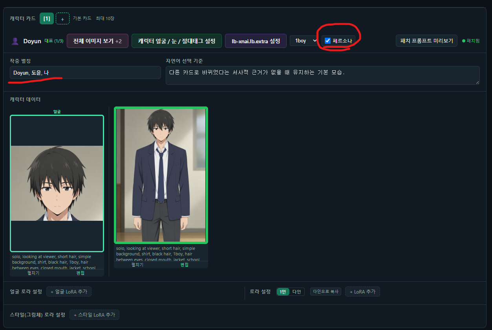

하루만에 보네

대단한건 아니고, 피드백이 들어와서 추가로 업데이트 했어

원래라면, 개인 기능 개발 + 버그 픽스 + 피드백으로 묶어서 1~2주일 단위로 업데이트를 올리겠지만

지금 잠깐 개인 기능 개발은 멈춰있는 상태니까, 그냥 바로 올려버렸네

이번 업데이트는 내역 보고 개인적으로 필요한 사람만 가져가도 괜찮아

1. 삽화모드에 페르소나 지정 모드가 추가되었어, 페르소나가 잘 안나온다는 제보를 받았거든, 해결했고, 내 구조에서는 복잡한 문제도 아니라 판단해서 그냥 고쳤어. 다만 실제로 깊게 테스트 해본건 아니니 잘 안되면 말해줘, 그때는 좀 더 신중하게 살펴볼께

2. 프로그램 설치시 워크플로우 무결성 검사 버튼울 추가하고, 내부 워크플로우 경로 지정 문제를 고쳤어

아래 업데이트 글 봐도 내용이 따로 없을 수도 있는데, 사실 9015 / 0916 업데이트 같은 경우 사용자 입장에서 큰 튜토리얼이 필요한 내용이 없어서 그냥 내가 미루고 있는 것뿐이야

그래도 업데이트 정리를 하긴 해야하니 언젠가는 글 쓰긴 할듯

https://arca.live/b/characterai/180736415

---

페르소나 지정 모드에 대해서

나는 다음과 같이 세팅해주었어
로라 세팅은 자유, 어차피 어제(0915) 업데이트 건으로 다인 케이스는 해결된 상태라 자유롭게 진행해줘

---

버그 제보/피드백은 항상 받고 있어 댓글에 남겨줘

복잡한 사항은 글을 쓴 뒤 글의 링크를 댓글에 남겨줘

문제를 해결한 케이스를 올려주면 정말 도움이 많이 되

있을지는 모르겠지만, 원한다면 프로그램 개조/편집 가능 (만들면 댓글에 남겨줘)

출처없는 프로그램 무단 도용이나, 상업적 이용은 삼가해줘

CREATIVE COMMONS-CC BY-NC-SA 4.0
